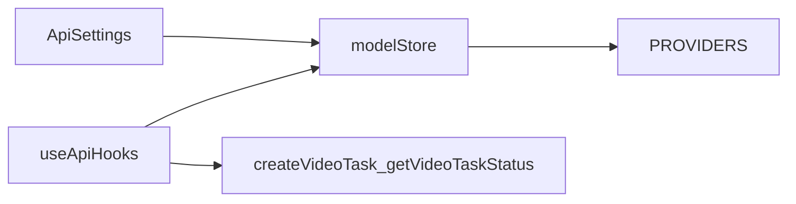

# 星图 Astraflow（UCloud Modelverse）集成计划

## 架构对齐（与 Chatfire 一致）

当前链路已具备：`**PROVIDERS` 定义端点与适配器** → `**[src/stores/pinia/models.js](src/stores/pinia/models.js)`** 按 `provider` 过滤模型、`get*Endpoint()` 拼 URL → `**useVideoGeneration` / `useChat` / 生图 API** 用 `modelStore.currentProvider` + `getProviderConfig` 发请求。

新增渠道即：**在 `[src/config/providers.js](src/config/providers.js)` 增加 `astraflow` 块**（`label`、`defaultBaseUrl`、`endpoints`、`requestAdapter`/`responseAdapter`），并确保 `[getProviderList](src/config/providers.js)` 能列出（排除 `default` 键即可）。

**实施第一步（必读文档）**：根据 [快速开始](https://docs.ucloud.cn/modelverse/api_doc/quick-start) 与 [文本模型列表](https://docs.ucloud.cn/modelverse/api_doc/text_api/models) 确认：**网关 Host、是否统一 `/v1` 前缀、鉴权方式（通常为 `Authorization: Bearer <KEY>`）、各能力路径**。若与 OpenAI 兼容，可复用 Chatfire 同构的 `endpoints`（`chat` / `image` / `video` / `videoQuery`）；若路径不同，只在 `astraflow` 配置里写官方路径，不必改全局 axios 逻辑。

## 1. Provider 与默认 Base URL

- 在 `PROVIDERS.astraflow` 中设置 `label: '星图 (Astraflow)'`（或 PRD 文案），`defaultBaseUrl` **以官方文档为准**写入（占位可在 MR 描述里注明「待文档确认后定稿」）。
- `requestAdapter` / `responseAdapter`：**优先与 `chatfire` 对齐**（OpenAI 风格 chat、images、异步视频创建+查询）；若 Modelverse 视频返回字段与火山/Chatfire 不同，在 `responseAdapter.video` 中解析出统一 `url`（与现有 `[pollVideoTask](src/hooks/useApi.js)` 消费方式一致）。

## 2. 模型清单（`[src/config/models.js](src/config/models.js)`）

- **图片 / 视频**：按 PRD **写死**若干条内置模型，`provider: ['astraflow']`，并包含现有节点所需的 `ratios` / `durs` / `defaultParams` / `async` 等字段（可复制同形态模型如 Seedream / Seedance 的结构再改 key 与展示名）。
  - 默认图模：`doubao-seedream-4.5`
  - 默认视频模：`gemini-3.1-flash-image-preview`（名称与「视频」能力需在 [平台概述/模型列表](https://docs.ucloud.cn/modelverse/README) 或视频 API 文档中核对；若实为图模，需与产品确认后再落 `VIDEO_MODELS`）。
- **文本**：在 `CHAT_MODELS` 中为 `deepseek-ai/DeepSeek-V3.2` 增加 `provider: ['astraflow']`（或仅保留动态列表——见下条），以便未拉取列表时仍有默认可选。

## 3. 文本模型动态拉取

- 新增小模块（建议 `[src/api/astraflowModels.js](src/api/astraflowModels.js)` 或 `src/utils/modelverseTextModels.js`）：在 **已配置 `astraflow` 的 baseUrl + apiKey** 下，请求官方「获取模型列表」接口（路径以 [text_api/models](https://docs.ucloud.cn/modelverse/api_doc/text_api/models) 为准），解析为 `{ key, label }[]`。
- 写入 `**customChatModelsByProvider['astraflow']`**（复用 Pinia 已有结构，见 `[models.js` L147–198](src/stores/pinia/models.js)），避免污染全局 `CHAT_MODELS`。
- 触发时机（择一或组合）：保存 API 设置成功后、`setProvider('astraflow')` 时、或打开 Api 设置弹窗且当前渠道为 astraflow 时；失败时降级为内置默认 + 提示用户检查 Key/Base URL。

## 4. API 设置 UI（`[src/components/ApiSettings.vue](src/components/ApiSettings.vue)`）

- `providerOptions` 来自 `modelStore.providerList`，新增渠道后自动出现 **「星图 (Astraflow)」**。
- `updateFormApiConfig` 已在切换渠道时填充 `defaultBaseUrl`，**无需大改**；可按渠道展示不同帮助链接（PRD：链到 `[docs/rag/官方文档地址.md](docs/rag/官方文档地址.md)` 或 UCloud 文档）。
- **保存时**（`handleSave`）：若 `formData.provider === 'astraflow'`，将 `selectedChatModel` / `selectedImageModel` / `selectedVideoModel` 设为 PRD 默认值（若当前选中模型不在 astraflow 可用列表中则强制切换）。

## 5. 视频 / 生图请求路径（`[src/hooks/useApi.js](src/hooks/useApi.js)` 等）

- `createVideoTaskOnly` 当前逻辑：`videoProvider = usesVolcengineVideoApi ? volcengine : modelStore.currentProvider`，**astraflow 会走 `getProviderConfig(astraflow)`**，一般只需保证 `endpoints` 与 body 适配正确。
- 若 **Seedance 类**模型在星图侧与 Chatfire 相同 body：可沿用现有 `useChatfireSeedanceBody` 条件，**扩展为** `(videoProvider === 'chatfire' || videoProvider === 'astraflow') && model.includes('seedance')`，并复用 `chatfireCfg.requestAdapter.video` 或抽成公共函数避免重复。
- `[src/utils/request.js](src/utils/request.js)`：`noAuthEndpoints` 若需放行 Modelverse 的「拉模型列表」路径，按实际 URL **追加**匹配片段（避免误带 Bearer 若官方要求匿名；以文档为准）。

## 6. 联调测试与欠费提示（开发完成后）

- **联调范围**：在渠道选「星图 (Astraflow)」、使用 PRD 默认模型各走通一条最小请求——**文本**（流式或非流式补全）、**图片**（单张生成）、**视频**（创建任务 + 必要时轮询至成功或明确失败）。可在浏览器内手工点节点验证，或增加 **Vitest/Playwright 级别的 smoke**（若引入自动化，须从环境变量读取 Key，默认跳过无 Key 的用例）。
- **密钥**：**禁止**把任何星图 Key 写入仓库、`docs/`、计划正文或示例配置。联调仅在本地「API 设置」或 `.env.local`（若项目约定）中配置；聊天/PRD 中若出现过明文 Key，视为泄露，**应轮换**。
- **欠费 / 余额**：对接口 **4xx/5xx 及业务 JSON** 做轻量识别（如 `insufficient`、`balance`、`欠费`、`余额`、`402`、`billing` 等，以星图实际返回为准），统一通过 `window.$message`（或现有错误管道）提示用户 **前往 UCloud/星图控制台充值**，避免只显示裸 `Request failed`。

## 7. 其它引用点排查

- `[src/api/chat.js](src/api/chat.js)`：`streamChatCompletions` 使用 `localStorage api-provider` + `api-keys-by-provider`，与 Pinia 保存一致即可，**一般不改**。
- `[VideoConfigNode.vue](src/components/nodes/VideoConfigNode.vue)` / `[usesVolcengineVideoApi](src/config/models.js)`：新视频模型若不走路由火山，保持 `false` 即可。
- **安全**：删除或脱敏 `[docs/todo/2-星图集成PRD.md](docs/todo/2-星图集成PRD.md)` 中疑似 Key 的行，勿提交密钥；若已泄露需轮换。

## 8. 文档与提交

- 新建 `docs/dev/YYYY-MM-DD-astraflow-provider.md`（日期以执行日 `date` 为准）：记录确认的 Base URL、文本列表接口路径、图/视频默认模型与已知限制。
- Commit：类型 `feat(api): 星图 Astraflow 渠道与模型`，正文与 dev 文档一致。

## 风险与依赖

- **Base URL 与路径**必须以 UCloud Modelverse 官方为准；本仓库 `[docs/rag/官方文档地址.md](docs/rag/官方文档地址.md)` 仅索引链接。
- **视频模型 ID** `gemini-3.1-flash-image-preview` 命名偏图模，需与平台「全部模型」列表核对后再写入 `VIDEO_MODELS`，避免接入后创建任务 4xx。

