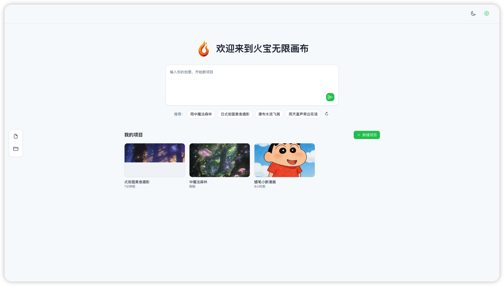
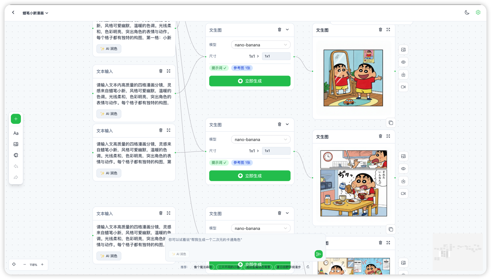

# 闪创空间（Shanchuang Space）

基于 **Vue Flow** 的可视化 **AI 创作工作流**应用：用节点与连线编排**文生图**、**视频生成**、**分镜脚本**等能力，支持本地项目管理、撤销重做、深色模式与**本地媒体落盘**（缓解对象存储签名链接过期问题）。


## 产品定位

- **闪创空间**：面向创作者与团队的**节点式 AI 画布**，把提示词、模型参数、参考图与生成结果串成可复用流程。  
- **Web 路径前缀**：应用部署在 **`/shanchuang-space/`** 下（与 `vite.config.js` 的 `base`、Vue Router 一致）。自建或反向代理时请保持路径一致。

## ✨ 特性概览

| 能力 | 说明 |
|------|------|
| 可视化编排 | 无限画布、缩放平移、网格吸附、打组与批量操作 |
| 文生图 / 图生图 | 多模型、尺寸与数量；多图预览、主图与下载 |
| 视频生成 | 首帧 / 尾帧、批量分镜视频、任务轮询与结果展示 |
| 脚本与分镜 | 脚本节点、分镜表与故事板工作流 |
| 智能编排 | 根据输入意图建议工作流并自动串行执行节点 |
| 本地项目 | 浏览器本地持久化多项目；缩略图与历史记录 |
| 本地媒体服务 | 可选 Node 服务将生成资源落入 `uploads/`，预览优先本地，视频支持凭 `taskId` 刷新链接 |
| 体验 | 深浅色主题、API 设置、撤销 / 重做 |

## 📸 截图

> 若仓库内截图路径与下列不一致，请将图片放在 `docs/doc/` 并更新链接。

| 页面 | 预览 |
|------|------|
| 首页 |  |
| 画布 |  |
| API 配置 |  |

## 📦 主要节点类型

| 节点 | 说明 |
|------|------|
| 文本 | 提示词与多场景文案 |
| 文生图配置 | 模型、尺寸、数量、风格与内联生成结果 |
| 图片 | 展示或上传图片 |
| 视频配置 | 视频模型、比例、时长、首尾帧等 |
| 视频 | 展示生成视频或本地上传 |
| 脚本 | 分镜脚本生成与批量视频入口 |
| LLM 配置 | 对话与文本生成 |

## 🚀 快速开始

### 环境要求

- **Node.js** ≥ 18  
- **pnpm** / **npm** / **yarn**

### 从旧版（火宝画布 / `huobao-canvas`）升级

- 应用路径由 **`/huobao-canvas/`** 改为 **`/shanchuang-space/`**，反向代理与书签需同步更新。  
- 浏览器中 **本地项目列表** 的存储键已更换，旧数据不会自动出现在「我的项目」中；若需保留，可在开发者工具 Application → Local Storage 中自行将原 `ai-canvas-projects` 键值复制到新键 **`shanchuang-space-projects`**（需自行承担格式兼容风险）。

### 安装

```bash
git clone <你的仓库地址> shanchuang-space
cd shanchuang-space

pnpm install
# 或
npm install
```

```bash
cp .env.example .env
# 按需编辑；修改后需重启开发服务
```

### 启动（开发）

浏览器访问（端口以终端为准）：

**`http://localhost:5173/shanchuang-space/`**

| 方式 | 命令 | 说明 |
|------|------|------|
| **推荐** | `pnpm dev:all` / `npm run dev:all` | 同时启动 Vite + 媒体服务（默认 `8787`），资源写入 `./uploads/` |
| 双终端 | `pnpm run server` + `pnpm dev` | 便于分屏看日志 |
| 仅前端 | `pnpm dev` | 不调媒体服务时仍可生成，但无本地落盘与链接刷新能力 |

`/api/media` 由 Vite 代理到 `127.0.0.1:8787`；改端口请同步 `vite.config.js` 或设置 `VITE_MEDIA_API_URL`。

### 构建与生产

```bash
pnpm build
pnpm start
# 默认监听 8787：http://localhost:8787/shanchuang-space/
# 生产可设 PORT=80 等
```

| 变量 | 含义 |
|------|------|
| `SERVE_STATIC` | `1` / `true` 时由 Node 托管 `dist`（`npm run start` 已开启） |
| `PORT` | 监听端口，默认 **8787** |
| `MEDIA_ROOT` | 媒体目录，默认 **`<项目根>/uploads`** |

### Docker（可选）

```bash
docker build -t shanchuang-space .
docker run -p 80:80 -v "$(pwd)/uploads:/app/uploads" shanchuang-space
```

访问：**`http://localhost/shanchuang-space/`**

更详细的镜像与运维说明见 [`README.docker.md`](./README.docker.md)。

## ⚙️ 配置说明

1. 打开右上角 **设置**，配置 **API Base URL** 与 **API Key**，并选择模型。  
2. 支持 **OpenAI 兼容** 接口；默认示例渠道为 **Chatfire**（`api.chatfire.site`），可按需改为自建网关。  
3. **火山 Ark（豆包 Seedream / Seedance）**：可在根目录 `.env` 中配置 `VITE_VOLCENGINE_API_KEY`、`VITE_VOLCENGINE_BASE_URL`（详见 `.env.example`）。勿将 `.env` 提交到仓库。

### 本地媒体缓存

生成结果中的对象存储 URL 往往短期有效。启用 `server/index.mjs` 后，成功生成会写入 **`MEDIA_ROOT`**，界面优先请求本地文件；失败时会尝试用保存的远程地址再拉取，视频在必要时使用 **`videoTaskId`** 查询新地址。仅使用 Nginx 托管静态资源时，请为 **`/api/media/`** 反代到 Node（参考 `nginx.conf`）。

## 🛠️ 技术栈

Vue 3 · Vite · Vue Flow · Naive UI · Tailwind CSS · Pinia · Vue Router · Express（媒体服务）

## 📁 仓库结构（摘要）

```
src/           # 前端源码（api、components、views、stores、hooks…）
server/        # 本地媒体缓存与可选静态托管
docs/          # 产品/技术文档与 dev 留档
```

深度说明见 [`docs/TECH.md`](./docs/TECH.md)、[`docs/product-requirements-document.md`](./docs/product-requirements-document.md)。

## 🔄 自动执行工作流

根据首页或节点中的输入，系统可解析意图并自动创建、连接与执行节点（文生图、分镜、视频等）。核心逻辑见 `useWorkflowOrchestrator` 及相关配置。

## 📝 开发与留档

在 [`docs/dev/`](./docs/dev/) 按规范记录 Bug 修复与功能变更，并与提交信息对应。索引说明见 [`docs/dev/README.md`](./docs/dev/README.md)。

## 🤝 贡献

1. Fork 仓库  
2. 新建分支 `feature/your-feature`  
3. 提交并推送后发起 Pull Request  

## 📄 许可证

[MIT](./LICENSE)
