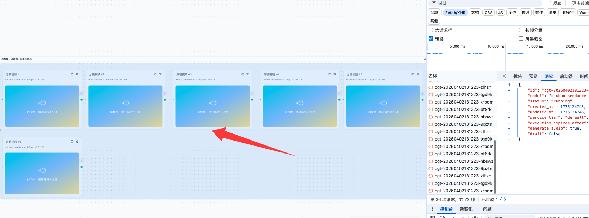
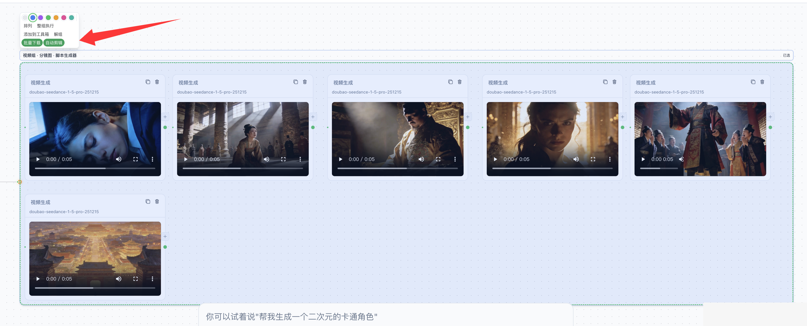
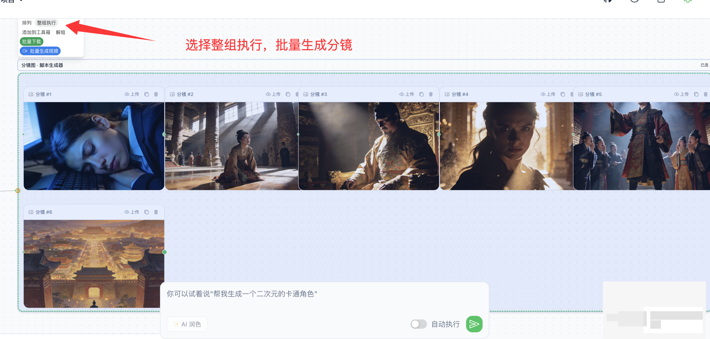
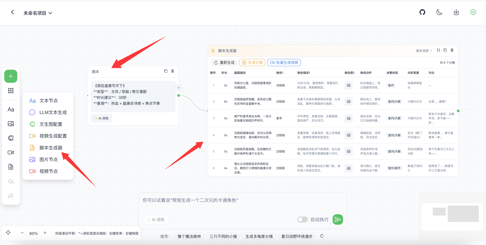

# 闪创空间（Shanchuang Space）

> 基于 **Vue Flow** 的可视化 **AI 创作工作流**：用节点与连线编排文生图、视频生成、分镜脚本等能力；支持本地项目管理、撤销重做、深浅色主题与可选 **本地媒体落盘**（缓解对象存储短链过期问题）。


[功能特性](#-功能特性) · [界面截图](#-界面截图) · [节点与连线](#-节点与连线类型) · [智能编排](#-智能工作流编排) · [快速开始](#-快速开始) · [配置与环境变量](#-配置说明) · [仓库结构](#-仓库结构)

---

## 产品定位

**闪创空间**面向创作者与团队，提供**节点式 AI 画布**：把提示词、模型参数、参考图与生成结果串成可复用、可保存的流程。

**部署路径前缀**：应用固定在 **`/shanchuang-space/`**（与 `vite.config.js` 的 `base`、`vue-router` 的 `createWebHistory` 一致）。自建或反向代理时请保持该前缀，否则静态资源与路由会 404。

---

## 功能特性

| 类别 | 说明 |
|------|------|
| **画布** | 无限画布、缩放平移（Mac 触控板可平移）、网格吸附、框选、**分组**（`groupProxy`）与分组工具栏 |
| **文生图 / 图生图** | 多模型、尺寸与数量；多图预览、设主图、下载；与文本节点、图片节点通过专用边传递角色与顺序 |
| **视频** | 首帧 / 尾帧、比例与时长；异步任务轮询、结果展示；可与图生视频链路衔接 |
| **脚本与分镜** | 脚本节点生成分镜结构；支持按分镜批量生成视频等流程（见 `ScriptNode`、`scriptStoryboard` 等工具） |
| **工作流模板** | 侧栏「公共工作流」一键落盘到画布（如多角度分镜、场景示例等，`src/config/workflows.js`） |
| **智能编排** | 首页或画布底部输入自然语言，解析意图后自动创建节点、连线并**串行执行**（`useWorkflowOrchestrator`） |
| **本地项目** | 浏览器 `localStorage` 多项目、缩略图与历史；存储键 **`shanchuang-space-projects`** |
| **本地媒体服务** | 可选 Node 服务将生成资源写入 `uploads/`，预览优先走本地；视频可凭 `taskId` 刷新链接 |
| **体验** | Naive UI + Tailwind；深浅色；API 设置；撤销 / 重做；批量下载素材弹窗 |

---

## 界面截图

截图源文件位于 [`docs/images/项目截图/`](./docs/images/项目截图/)。在 GitHub 上浏览本仓库时，下列图片会直接渲染。

### 1. 图片生成

文生图 / 图生图画布：文本提示、文生图配置节点、生成结果图片节点与节点间连线，体现「提示 → 配置 → 出图」的典型链路。

<p align="center">
  
</p>

### 2. 视频生成

视频配置与视频结果节点：首帧参考、模型与比例等参数，以及生成完成后的视频预览区域。

<p align="center">
  
</p>

### 3. 批量生成分镜

分镜相关布局：多路分镜配置与结果并排或成组，便于批量出图后再接脚本或视频步骤。

<p align="center">
  
</p>

### 4. 脚本生成器

脚本节点界面：基于剧情的分镜脚本生成与编辑，作为后续「按镜出图 / 出视频」的输入源。

<p align="center">
  
</p>

---

## 节点与连线类型

画布在 `Canvas.vue` 中注册下列 **节点类型**（`type` 字段）：

| `type` | 组件 | 作用摘要 |
|--------|------|----------|
| `text` | `TextNode` | 提示词、多段文案 |
| `imageConfig` | `ImageConfigNode` | 文生图参数与内联生成、多图结果 |
| `image` | `ImageNode` | 展示远程 / 本地 URL、上传或引用 |
| `videoConfig` | `VideoConfigNode` | 视频模型、时长、首尾帧等 |
| `video` | `VideoNode` | 展示生成视频或本地上传 |
| `llmConfig` | `LLMConfigNode` | 对话与文本生成（OpenAI 兼容等） |
| `script` | `ScriptNode` | 分镜脚本生成与批量视频相关入口 |
| `groupProxy` | `GroupProxyNode` | 分组代理（与视觉分组框配合） |

**边类型**（自定义 Edge）：

| `type` | 组件 | 用途 |
|--------|------|------|
| `promptOrder` | `PromptOrderEdge` | 提示词 / 顺序类依赖 |
| `imageRole` | `ImageRoleEdge` | 图片作为角色或参考的语义连接 |
| `imageOrder` | `ImageOrderEdge` | 多图顺序或链式关系 |

---

## 智能工作流编排

`useWorkflowOrchestrator` 会根据用户输入调用 LLM 做**意图分类**，再自动创建节点与边并**按依赖串行执行**。常见类型包括：

| 类型键 | 含义（简述） |
|--------|----------------|
| `text_to_image` | 单图 / 以图为主的生成 |
| `text_to_image_to_video` | 出图后继续视频（如「动起来」类需求） |
| `storyboard` | 多分镜场景描述与出图 |
| `multi_angle_storyboard` | 正视 / 侧视 / 后视 / 俯视等多角度四宫格分镜 |
| `picture_book` | 儿童绘本式多页叙事 |

画布上亦可打开 **工作流面板**，从 `WORKFLOW_TEMPLATES` 选择模板一键插入（与编排器互补：模板偏固定拓扑，编排器偏自然语言）。

---

## 路由与页面

| 路径（均挂在 `/shanchuang-space` 下） | 页面 | 说明 |
|--------------------------------------|------|------|
| `/` | `Home.vue` | 欢迎区、创意输入、快捷推荐、「我的项目」网格 |
| `/canvas/:id?` | `Canvas.vue` | 主画布、Vue Flow、工作流面板、底部输入与编排 |

---

## 快速开始

### 环境要求

- **Node.js** ≥ 18  
- **pnpm** / **npm** / **yarn**

### 从旧版（火宝画布 / `huobao-canvas`）升级

- 应用路径由 **`/huobao-canvas/`** 改为 **`/shanchuang-space/`**，反向代理与书签需同步更新。  
- 浏览器 **本地项目** 存储键已更换，旧数据不会自动迁移；若需手动迁移，可在开发者工具 **Application → Local Storage** 将原 `ai-canvas-projects` 复制到新键 **`shanchuang-space-projects`**（格式兼容需自行承担风险）。

### 安装

```bash
git clone <你的仓库地址> shanchuang-space
cd shanchuang-space

pnpm install
# 或 npm install
```

```bash
cp .env.example .env
# 按需编辑；修改后需重启开发服务
```

### 启动（开发）

浏览器访问（端口以终端为准）：

**http://localhost:5173/shanchuang-space/**

| 方式 | 命令 | 说明 |
|------|------|------|
| **推荐** | `pnpm dev:all` / `npm run dev:all` | 同时启动 Vite + 媒体服务（默认 **8787**），资源写入 `./uploads/` |
| 双终端 | `pnpm run server` + `pnpm dev` | 分屏查看前后端日志 |
| 仅前端 | `pnpm dev` | 无本地落盘与链接刷新时仍可调用远端 API 生成 |

开发环境下 `/api/media` 由 Vite 代理到 `127.0.0.1:8787`；改端口请同步 `vite.config.js` 或设置 `VITE_MEDIA_API_URL`。

### 构建与生产

```bash
pnpm build
pnpm start
# 默认监听 8787：http://localhost:8787/shanchuang-space/
# 生产可设 PORT=80 等
```

| 变量 | 含义 |
|------|------|
| `SERVE_STATIC` | `1` / `true` 时由 Node 托管 `dist`（`npm run start` 已开启） |
| `PORT` | 监听端口，默认 **8787** |
| `MEDIA_ROOT` | 媒体目录，默认 **`<项目根>/uploads`** |

### Sora2 图生视频首帧（火山 TOS）

星图侧 **Sora 图生视频** 的 `first_frame_url` 需要公网 **http(s)** 图片地址。若首帧来自本地上传（data URL），需启动媒体服务并在服务端配置火山 **TOS**，由 `POST /api/media/sora-frame-upload` 上传后返回公网 URL。`npm run server` 读取项目根 **`.env`** 中的 **`VOLCENGINE_TOS_*`**（可与前端 `VITE_*` 同文件，勿提交密钥）。

| 变量 | 含义 |
|------|------|
| `VOLCENGINE_TOS_ACCESS_KEY_ID` | TOS 访问密钥 ID |
| `VOLCENGINE_TOS_SECRET_ACCESS_KEY` | TOS Secret |
| `VOLCENGINE_TOS_BUCKET` | 存储桶名称 |
| `VOLCENGINE_TOS_REGION` | 可选，默认 `cn-beijing` |
| `VOLCENGINE_TOS_ENDPOINT` | 可选，如 `https://tos-cn-beijing.volces.com` |
| `VOLCENGINE_TOS_OBJECT_PREFIX` | 可选，对象键前缀 |
| `VOLCENGINE_TOS_PUBLIC_BASE_URL` | 可选，CDN 或自定义公网前缀 |

桶策略或对象 ACL 需允许 **Modelverse 等服务端** 能拉取该 URL。

### Docker（可选）

```bash
docker build -t shanchuang-space .
docker run -p 80:80 -v "$(pwd)/uploads:/app/uploads" shanchuang-space
```

访问：**http://localhost/shanchuang-space/**

详见 [`README.docker.md`](./README.docker.md)。

---

## 配置说明

1. 打开右上角 **设置**，配置 **API Base URL**、**API Key** 与模型。  
2. 支持 **OpenAI 兼容** 接口；默认示例代理为 **Chatfire**（`api.chatfire.site`），可改为自建网关。开发时 `vite.config.js` 将 `/v1` 代理到该域名。  
3. **火山 Ark（豆包 Seedream / Seedance）**：在根目录 `.env` 配置 `VITE_VOLCENGINE_API_KEY`、`VITE_VOLCENGINE_BASE_URL` 等（见 [`.env.example`](./.env.example)）。**勿将 `.env` 提交仓库。**  
4. **星图 Modelverse（Gemini 等）**：通过 `/__modelverse` 代理避免浏览器 CORS（见 `vite.config.js`）。

### 本地媒体缓存

生成结果中的对象存储 URL 往往短期有效。启用 `server/index.mjs` 后，成功生成会写入 **`MEDIA_ROOT`**，界面优先请求本地文件；视频在必要时使用 **`videoTaskId`** 查询新地址。若仅用 Nginx 托管静态资源，请把 **`/api/media/`** 反代到 Node（参考仓库内 `nginx.conf`）。

### 前端环境变量摘要

| 变量 | 作用 |
|------|------|
| `VITE_VOLCENGINE_API_KEY` | 火山 Ark 密钥 |
| `VITE_VOLCENGINE_BASE_URL` | Ark 推理 Base，如 `https://ark.cn-beijing.volces.com/api/v3` |
| `VITE_MEDIA_API_URL` | 可选，媒体服务完整 origin（默认走同源 `/api/media`） |

---

## 技术栈

Vue 3 · Vite · Vue Flow（含 Background / Controls / Minimap）· Naive UI · Tailwind CSS · Pinia · Vue Router · Axios · Express（媒体服务）· 可选 `@ffmpeg/ffmpeg`（前端侧能力，见 Vite `optimizeDeps` 配置）

---

## 仓库结构

```
shanchuang-space/
├── src/
│   ├── api/              # HTTP：图片 / 视频 / 对话 / 模型等
│   ├── components/       # 通用 UI、WorkflowPanel、DownloadModal…
│   │   ├── nodes/        # 各节点类型 Vue 组件
│   │   └── edges/        # 自定义边组件
│   ├── config/           # 工作流模板、模型、渠道、轮询上下文等
│   ├── hooks/            # useWorkflowOrchestrator、useApi、useModelConfig…
│   ├── stores/           # Pinia + 画布 / 项目等响应式模块
│   ├── utils/            # 媒体、分镜、下载、本地媒体客户端等
│   ├── views/            # Home.vue、Canvas.vue
│   ├── App.vue
│   └── main.js
├── server/               # Express：本地媒体缓存、可选静态托管、TOS 上传等
├── docs/                 # TECH、产品说明、dev 留档、截图等
├── uploads/              # 默认本地媒体目录（gitignore，运行时生成）
├── vite.config.js
├── package.json
└── .env.example
```

- 技术架构总览：**[1-技术架构文档](./docs/1-技术架构文档.md)**  
- 产品需求与设计解析（PRD）：**[2-闪创空间 PRD](./docs/2-闪创空间%20-%20产品需求与设计解析文档%20%28PRD%29.md)**（文件名含空格与括号，链接已编码）  
- 核心系统架构与代码复刻：**[3-核心系统架构与代码复刻指南](./docs/3-闪创空间%20-%20核心系统架构与代码复刻指南.md)**  
- 变更留档索引：**[docs/dev/README.md](./docs/dev/README.md)**

---

## 开发与留档

在 [`docs/dev/`](./docs/dev/) 按项目规范记录缺陷修复与功能变更，并与 Git 提交信息对应。

---

## 贡献

1. Fork 本仓库  
2. 新建分支 `feature/your-feature`  
3. 提交并推送后发起 Pull Request  

---

## 许可证

[MIT](./LICENSE)
