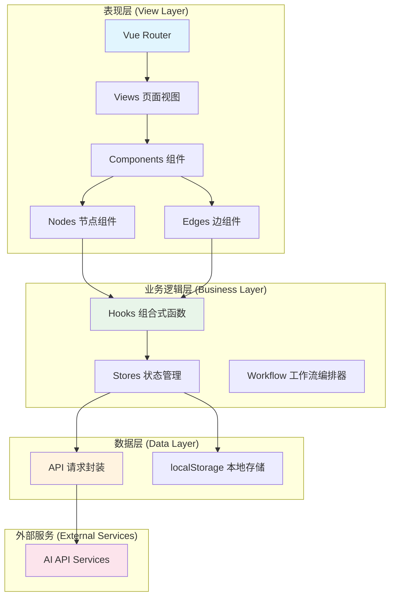
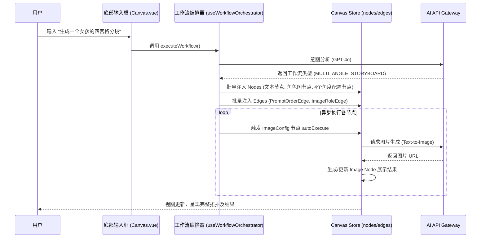
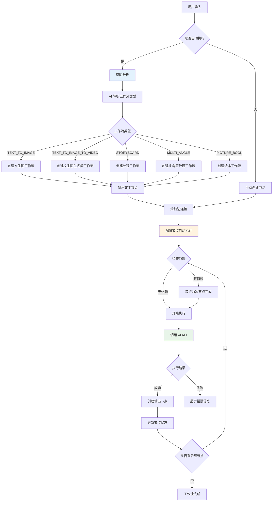
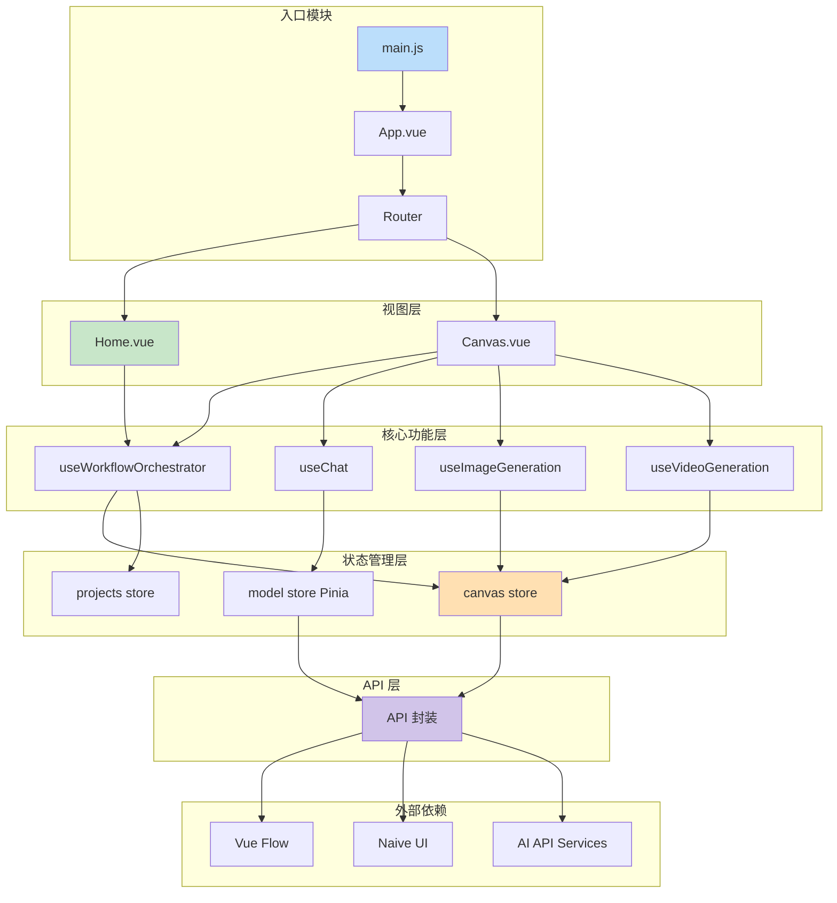
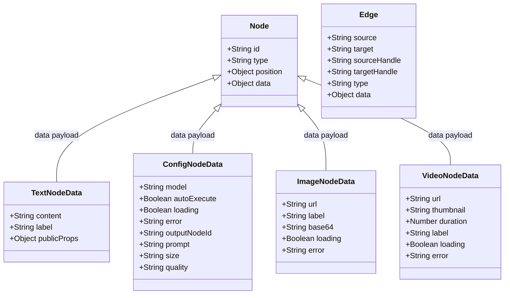
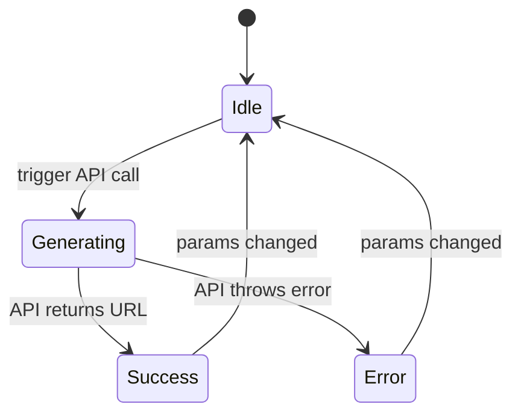
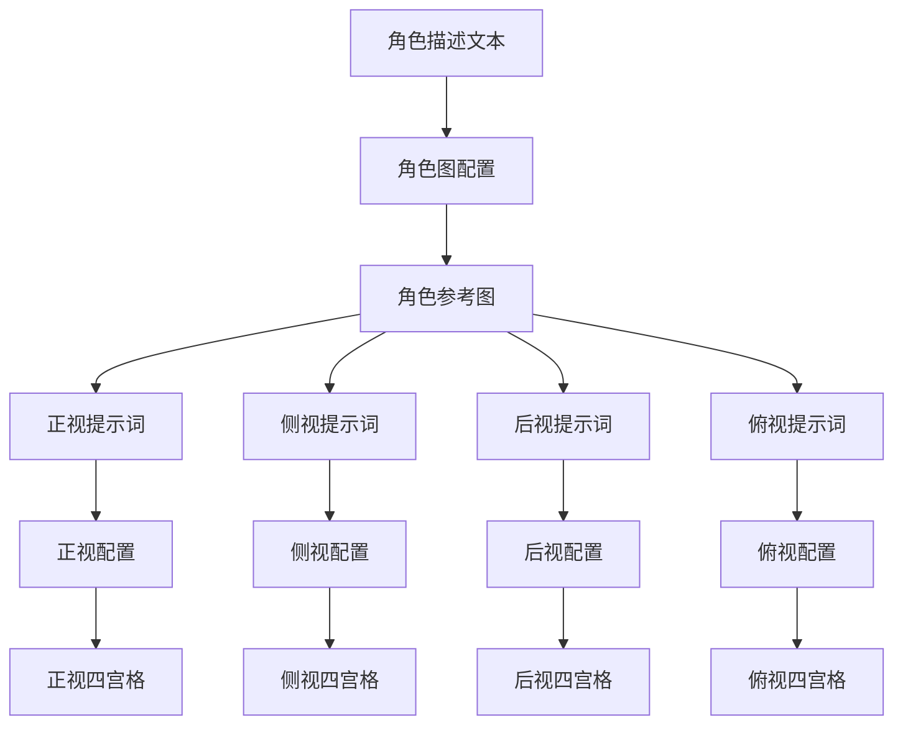
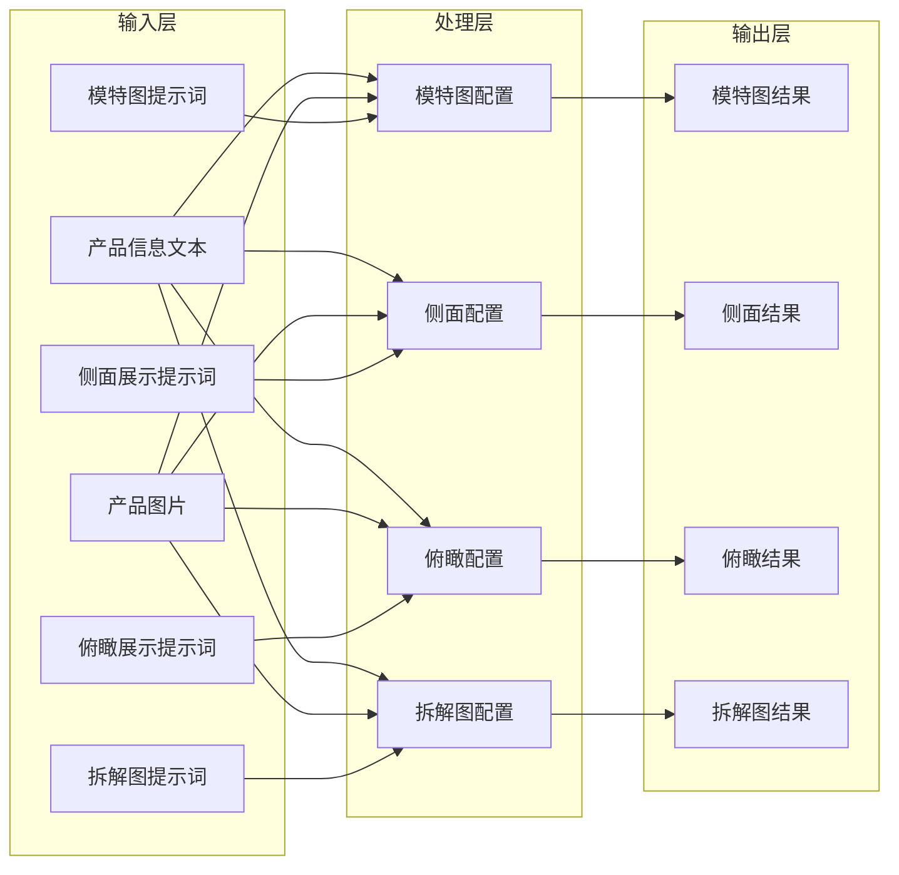
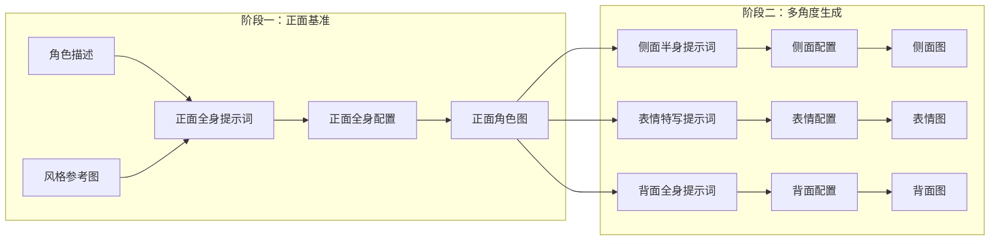
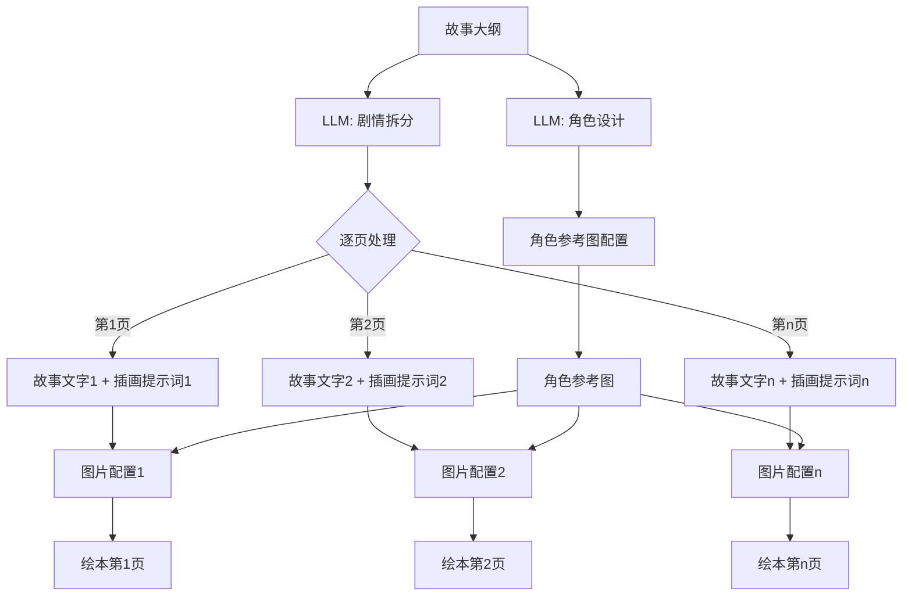

# 闪创空间深度技术设计文档

> 本文档旨在对 `shanchuang-space` 项目进行极其详尽的系统解剖，从架构设计、核心模块实现、数据流管理、API集成、部署运维等多个维度进行深度剖析，指导核心开发者进行架构理解、功能扩展及二次开发。文档涵盖项目的所有核心技术点，包括Vue 3组合式API的最佳实践、Vue Flow图可视化引擎的深度定制、工作流编排算法的实现细节、多渠道API适配机制的架构设计等。通过本文档，开发者可以全面掌握项目的设计理念和实现原理，为后续的功能迭代和技术演进奠定坚实的理论基础。

---

## 目录

- [卷一：深度项目概览与设计哲学](#卷一深度项目概览与设计哲学)
- [卷二：系统架构解剖与模块交互](#卷二系统架构解剖与模块交互)
- [卷三：核心子系统详解——画布与节点引擎](#卷三核心子系统详解画布与节点引擎)
- [卷四：核心子系统详解——智能工作流编排](#卷四核心子系统详解智能工作流编排)
- [卷五：数据与存储架构](#卷五数据与存储架构)
- [卷六：网络通信与API集成](#卷六网络通信与api集成)
- [卷七：组件系统深度解析](#卷七组件系统深度解析)
- [卷八：样式系统与主题机制](#卷八样式系统与主题机制)
- [卷九：部署与运维实践](#卷九部署与运维实践)
- [卷十：性能优化与最佳实践](#卷十性能优化与最佳实践)

---

## 卷一：深度项目概览与设计哲学

### 1.1 核心定位与产品愿景

`shanchuang-space`（中文名：闪创空间）是一个基于节点的、可视化的AI创作工作流引擎。其核心产品定位是将人工智能能力具象化为可编排的视觉节点，让用户能够通过直观的拖拽和连线操作，自由组合出复杂的AI创作工作流。与传统的命令行式AI调用方式相比，闪创空间将整个创作过程可视化，用户可以清晰地看到数据在节点之间的流动，理解AI生成的完整链路。

从技术角度来看，闪创空间是一个典型的前端交互密集型应用，它需要处理大量的节点状态管理、实时交互反馈、复杂的边连接逻辑以及与后端AI API的异步通信。项目采用现代化的Vue 3技术栈，结合Vue Flow图可视化库和Naive UI组件库，实现了流畅的节点编辑体验。项目支持多种AI模型，包括图片生成模型（如豆包Seedream、Nano Banana系列）和视频生成模型（如Seedance系列），用户可以根据不同的创作需求选择合适的模型来完成任务。

项目的设计哲学可以概括为三个核心原则。首先是**可视化优先原则**，所有数据流向（如提示词到模型的传递、图片到视频首帧的转换）必须在画布上以有向边（Edge）的形式显式表达，这种设计让复杂的AI工作流变得直观易懂。其次是**状态自治原则**，每个节点拥有独立的生命周期和状态机（Idle、Loading、Success、Error），节点间的状态传递通过响应式状态管理完成，这种设计保证了节点的独立性和可复用性。第三是**AI驱动编排原则**，除了手动连线，系统内置了强大的`useWorkflowOrchestrator`（智能工作流编排器），通过分析用户的自然语言意图，自动在画布上生成并执行对应的拓扑结构，大大降低了用户的使用门槛。

### 1.2 技术栈全景解析

项目基于现代前端工程化标准构建，核心技术选型经过深思熟虑，每个技术点都有其明确的选型理由：

**核心框架：Vue 3.5.24 + Composition API**

Vue 3的Proxy响应式系统是项目选择它的核心原因。画布中节点坐标、状态、连线等数据更新极其频繁，传统的事件监听模式会造成大量不必要的DOM操作和性能损耗。Vue 3的响应式系统能够精确追踪依赖变化，只更新受影响的部分，实现细粒度的视图重绘。组合式API（Composition API）则提供了更好的代码组织方式，使得相关的逻辑可以集中在一起，而不是分散在不同的选项中，便于维护和复用。

**画布引擎：Vue Flow (@vue-flow/core 1.48.1)**

Vue Flow是Vue生态中最强大的节点连线引擎，它原生支持Vue的响应式系统，提供了开箱即用的拖拽、缩放、框选、连线吸附等能力。与其他图可视化库相比，Vue Flow对Vue 3的支持更加完善，API设计也更符合Vue的设计理念。通过自定义Node和Edge类型，可以轻易扩展出具有复杂业务逻辑的组件。项目基于Vue Flow构建了完整的节点体系，包括文本节点、配置节点、媒体节点等多种类型。

**状态管理：Pinia 3.0.4**

Pinia是Vue官方推荐的新一代状态管理方案，相比Vuex具有更简洁的API和更好的TypeScript支持。项目使用Pinia管理画布全局状态（nodes、edges、viewport）、项目管理（projects）、模型配置（models）等核心数据。其扁平化的Store设计非常适合管理复杂的图数据结构，模块化的组织方式也便于代码的维护和扩展。

**构建与样式：Vite 5.2.0 + Tailwind CSS 3.4.0 + Naive UI**

Vite提供了极速的冷启动和热模块替换（HMR），大大提升了开发体验。Tailwind CSS提供原子化CSS类名，加速了节点卡片和面板的UI开发，通过自定义配置可以轻松实现主题切换。Naive UI是Vue 3生态中质量较高的企业级组件库，提供了高质量的基础表单组件（如下拉选择、开关、按钮等），确保了项目的视觉效果和交互体验达到生产级别标准。

**辅助技术栈**

项目还使用了一些重要的辅助技术：@vicons/ionicons5提供了丰富的图标资源；axios用于HTTP请求的封装和处理；vue-router用于单页应用的路由管理。这些技术共同构成了项目完整的技术生态。

### 1.3 核心功能特性

闪创空间提供了丰富的功能特性，这些特性共同构成了一个完整的AI工作流编排系统：

**可视化节点编排**：基于Vue Flow的无限画布支持拖拽、缩放、连接等交互操作，用户可以在画布上自由布置节点，并通过连接边来定义节点之间的数据流向。画布支持网格对齐、视口缩放（0.1x到2x）、小地图导航等功能，为用户提供了极大的操作灵活性。

**文生图工作流**：允许用户输入提示词，选择模型、尺寸、画质等参数来生成图片。支持多种图片生成模型，每种模型都有不同的尺寸选项和画质级别。用户可以灵活配置生成参数，获得最佳的生成效果。

**视频生成工作流**：支持图生视频功能，用户可以设置首帧和尾帧图片来控制视频的生成方向。视频生成通常是异步任务，系统实现了完整的任务轮询机制，定期查询后端任务的执行状态直到完成。

**AI提示词润色**：集成了AI提示词润色功能，通过调用大语言模型来优化用户的提示词，提升生成质量。这一功能对于不熟悉提示词工程的用户非常有用。

**多类型工作流**：系统支持多种预设工作流类型，包括文生图、文生图生视频、分镜工作流、多角度分镜工作流、绘本工作流等。每种工作流都有其特定的应用场景和执行逻辑。

**本地项目管理**：用户创建的项目数据会持久化到浏览器的localStorage中，支持多项目管理。系统会自动保存用户的操作历史，支持撤销和重做功能。

**主题切换**：支持深色和浅色两种主题模式，用户可以根据个人喜好进行切换，保护眼睛的同时也提供了更好的视觉体验。

### 1.4 项目架构总览图



---

## 卷二：系统架构解剖与模块交互

### 2.1 宏观架构设计

系统整体采用典型的“分层+总线”架构，从下至上分为存储层、引擎层、业务层和视图层。这种分层架构的设计使得各层职责清晰，便于代码的维护和扩展。

**存储层（Data Layer）**

存储层是整个系统的基础，负责数据的持久化和状态管理。它包括三个主要的Store：Canvas Store管理画布的核心数据（节点、边、视口）；Projects Store管理项目列表和历史记录；Models Store管理AI模型配置和API设置。存储层直接与浏览器的localStorage交互，实现数据的本地持久化，无需后端数据库即可运行。

**引擎层（Core Layer）**

引擎层是系统的核心计算单元，提供关键的底层能力。它包括三个主要模块：Vue Flow核心引擎负责画布的渲染和交互处理；工作流编排器负责分析用户意图并生成执行计划；API通信网关负责与外部AI服务的通信。引擎层向上为业务层提供服务接口，向下管理存储层的数据操作。

**业务层（Business Layer）**

业务层位于视图层和引擎层之间，负责将底层的原子能力组合成完整的业务功能。它包括各种Hook函数（如useChat、useImageGeneration、useVideoGeneration等），这些Hook封装了特定的业务逻辑，为视图层提供简洁的调用接口。业务层不直接操作存储层，而是通过引擎层提供的接口完成数据交互。

**视图层（View Layer）**

视图层是用户直接交互的界面，包括各种Vue组件。Views层定义了页面的主结构（如Home.vue、Canvas.vue），Components层则包含了所有可复用的UI组件。视图层遵循Vue 3的组件化开发模式，通过props接收数据，通过events向上传递交互事件。

### 2.2 核心模块交互拓扑

系统中最核心的交互链路是“用户输入 → AI分析 → 画布拓扑生成 → API异步调用 → 结果回填”。这个链路贯穿了所有核心模块，展示了系统的工作原理。



从序列图中可以看出，整个交互流程是一个典型的异步处理流程。用户输入后，工作流编排器首先进行意图分析，确定工作流类型；然后在画布上创建相应的节点和边；最后通过异步循环执行各个节点，完成整个工作流。每个步骤之间通过状态变化进行驱动，实现了松耦合的模块交互。

### 2.3 数据流向架构



### 2.4 模块依赖关系图



---

## 卷三：核心子系统详解画布与节点引擎

### 3.1 画布系统职责定义

画布系统是整个应用的基石，负责渲染所有的节点（Nodes）和连线（Edges），并处理用户交互（拖拽、连线、缩放）。所有的业务数据（如提示词、图片URL、API配置）均作为`node.data`挂载在Vue Flow的节点对象上。画布系统的工作质量直接影响用户体验和系统性能，因此是项目开发中重点关注的模块。

Vue Flow作为画布的核心引擎，为项目提供了强大的底层支持。画布支持无限画布特性，用户可以自由拖拽和缩放；支持网格吸附功能，节点移动时会自动对齐到网格点；支持小地图导航，用户可以快速定位到画布的任意位置；支持多种交互模式，包括节点拖拽、边连接、框选、多选等。这些功能的实现都依赖于Vue Flow提供的API和事件系统。

在数据层面，每个节点是一个包含id、type、position和data四个基本属性的对象。id是节点在系统中的唯一标识符；type标识节点的类型（如'text'、'imageConfig'等）；position包含节点的x和y坐标；data是节点的业务数据，不同类型的节点有不同的data结构。这种设计将业务数据与渲染数据分离，便于数据的序列化和状态管理。

### 3.2 节点类型体系设计

项目中自定义了多种具有特定业务语义的节点类型，这些节点类型都注册在`src/views/Canvas.vue`中的nodeTypes对象中。每种节点类型都有其特定的功能定位和应用场景。

**TextNode（文本节点）**

文本节点是工作流的基础输入单元，用于提供提示词（Prompt）或剧本内容。文本节点使用了contenteditable技术来实现富文本编辑功能，并支持@语法来引用图片节点。这一功能允许用户在提示词中嵌入参考图片，从而实现图生图或多图融合的生成效果。

文本节点的核心功能包括：实时文本编辑，内容自动保存；@引用解析，自动识别和渲染图片引用；AI润色集成，调用大语言模型优化提示词；节点操作，支持复制、删除等基本操作。内容编辑使用了contenteditable div替代传统的textarea，以支持更丰富的文本渲染和交互。当用户输入@字符时，系统会弹出图片节点选择器，用户可以选择要引用的图片节点。选中的节点会以chips的形式显示在文本中，同时在底层数据中以@[nodeId]的格式存储。

**ImageConfigNode（文生图配置节点）**

文生图配置节点是实现图片生成功能的核心组件，它封装了模型选择、参数配置和生成执行等完整流程。节点提供了模型选择器（支持豆包Seedream、Nano Banana等多种模型）、画质选择器（标准画质、4K高清）、尺寸选择器（多种宽高比选项）等配置项。

节点支持多种输入来源：文本节点的提示词通过边连接传递；图片节点的参考图通过边连接或@引用传递。当有多个输入时，节点会根据边的类型（promptOrder或imageOrder）来确定输入的顺序，并按顺序拼接提示词或排列参考图。节点的执行支持三种模式：自动模式会在没有已连接输出节点时创建新节点；新建模式始终创建新的输出节点；替换模式会替换已连接节点的现有内容。

**VideoConfigNode（视频生成配置节点）**

视频生成配置节点与图片配置节点类似，但专注于视频生成任务。节点支持配置视频比例（16:9、9:16、1:1等）、时长（5秒、10秒）、分辨率（480p、720p、1080p）等参数。视频生成通常需要更长的时间，节点实现了任务轮询机制，定期查询后端任务的执行状态直到完成。

**LLMConfigNode（LLM配置节点）**

LLM配置节点通过大语言模型扩写或生成结构化提示词。这一节点类型可以用于复杂的工作流中，例如在绘本工作流中，LLM节点负责根据故事大纲生成详细的角色描述和分镜脚本。

**ImageNode和VideoNode（媒体展示节点）**

这两个节点是纯展示节点，负责渲染生成后的图片或视频结果。ImageNode支持用户手动上传图片作为参考源，用于Image2Video的首帧。VideoNode展示生成的视频内容，支持播放控制。

### 3.3 连线系统设计

普通连线只能表达拓扑关系，本项目中通过自定义Edge赋予了连线特定的业务语义。这种设计使得边不仅仅是视觉上的连接线，还承载了重要的业务信息。

**PromptOrderEdge（提示词顺序边）**

提示词顺序边用于表达提示词的组合顺序。当多个TextNode连接到同一个ImageConfigNode时，连线上会显示序号（1、2、3等），引擎会根据这个序号拼接最终的Prompt。这种设计解决了多个提示词如何组合的问题，用户可以精确控制提示词的优先级。

边的中间会显示顺序编号（①、②、③等），点击编号可以调整顺序。实现上，每个连接携带promptOrder属性，配置节点在读取输入时会按照这个顺序对提示词进行排序和拼接。当用户调整顺序时，系统会自动更新相关边的promptOrder属性，并重新计算组合后的提示词。

**ImageRoleEdge（图片角色边）**

图片角色边是视频生成特有的边类型。当ImageNode连接到VideoConfigNode时，连线属性定义了这张图片是作为“首帧（first_frame_image）”还是“尾帧（last_frame_image）”。首帧定义了视频的起始画面，尾帧定义了视频的结束画面，两者结合可以生成更可控的视频内容。

**ImageOrderEdge（图片顺序边）**

图片顺序边用于图片节点到配置节点的连接，它携带imageOrder属性来标记参考图的顺序。这个功能在需要使用多张参考图进行生成时非常重要，用户可以控制参考图的使用顺序。

### 3.4 节点数据模型类图



### 3.5 节点状态机

每个配置节点都遵循一个标准的状态机模型，用于管理节点的执行生命周期。



**Idle（空闲状态）**：节点已配置完成，等待执行或参数变化。

**Generating（生成中状态）**：节点正在调用API，loading标志为true此时UI会显示加载动画。用户可以看到生成进度，但不能进行其他会中断生成的操作。

**Success（成功状态）**：API成功返回结果，outputNodeId被设置，输出节点已创建并包含结果URL。节点可以继续执行下游任务。

**Error（错误状态）**：API调用失败，error属性包含错误信息。错误信息会显示在节点界面上，用户可以根据错误提示进行修正后重试。

---

## 卷四：核心子系统详解智能工作流编排

### 4.1 工作流编排器职责

`useWorkflowOrchestrator.js`是本项目的最强大脑，它解决的核心问题是：用户只需输入一句话，系统如何自动在画布上创建正确的节点拓扑，并协调它们按正确的顺序异步执行。这个Hook封装了完整的工作流编排逻辑，包括意图分析、节点创建、边连接、执行控制等功能。

工作流编排器的设计理念是将复杂的AI生成过程简化为用户的自然语言输入。用户不需要理解底层的节点和连接，只需要描述他们想要的结果（如“生成一个穿红裙子的女孩的多角度分镜”），系统会自动完成所有的工作。这种设计大大降低了使用门槛，让更多的用户能够体验到AI创作的便利。

### 4.2 意图分析与路由

系统首先使用GPT-4o进行意图分析，理解用户输入的语义并确定需要执行的工作流类型。这个过程包括以下几个步骤：

**输入分析**：将用户的自然语言输入发送给大语言模型，模型会分析输入的语义，提取关键信息。例如，“生成一个穿红裙子的女孩的多角度分镜”会被分析为需要执行多角度分镜工作流。

**类型识别**：根据分析结果确定工作流类型。项目目前支持五种工作流类型：text_to_image（文生图，默认类型）、text_to_image_to_video（文生图生视频）、storyboard（分镜工作流）、multi_angle_storyboard（多角度分镜工作流）、picture_book（儿童绘本工作流）。

**参数提取**：根据不同的工作流类型，提取相应的参数。例如，分镜工作流需要提取角色描述、各分镜的提示词等；绘本工作流需要提取故事标题、角色信息、每页的故事文字和插画描述等。

```javascript
const INTENT_ANALYSIS_PROMPT = `你是一个工作流分析助手。根据用户输入判断需要的工作流类型，并生成对应的提示词。

工作流类型：
1. text_to_image - 用户想要生成单张图片（默认）
2. text_to_image_to_video - 用户想要生成图片并转成视频
3. storyboard - 用户想要生成分镜/多场景图片
4. multi_angle_storyboard - 用户想要生成多角度分镜
5. picture_book - 用户想要生成儿童绘本
...`
```

### 4.3 编排执行引擎

编排器通过Promise和Vue的watch机制实现了一个异步节点状态机。这种设计的核心思想是：编排器不直接调用API，而是通过修改Store在画布上“画”出配置节点，并将节点设为autoExecute: true。节点自身内部的逻辑会检测到连线和状态变化，从而触发API请求。编排器仅仅是作为一个高层“观察者”，通过watch监听节点内部数据的变化来决定是否进入下一步。

**核心函数：waitForConfigComplete**

这个函数用于等待配置节点完成执行。它返回一个Promise，会一直等待直到配置节点的executed属性变为true并且outputNodeId被设置。

```javascript
const waitForConfigComplete = (configNodeId) => {
  return new Promise((resolve, reject) => {
    const timeout = setTimeout(() => {
      reject(new Error('执行超时'))
    }, 5 * 60 * 1000) // 5分钟超时
    
    let stopWatcher = null
    
    const checkNode = (node) => {
      if (!node) return false
      
      if (node.data?.error) {
        clearTimeout(timeout)
        if (stopWatcher) stopWatcher()
        reject(new Error(node.data.error))
        return true
      }
      
      if (node.data?.executed && node.data?.outputNodeId) {
        clearTimeout(timeout)
        if (stopWatcher) stopWatcher()
        resolve(node.data.outputNodeId)
        return true
      }
      return false
    }
    
    const node = nodes.value.find(n => n.id === configNodeId)
    if (checkNode(node)) return
    
    stopWatcher = watch(
      () => nodes.value.find(n => n.id === configNodeId),
      (node) => checkNode(node),
      { deep: true }
    )
    
    activeWatchers.push(stopWatcher)
  })
}
```

**核心函数：waitForOutputReady**

这个函数用于等待输出节点（图片或视频节点）准备好。它检查节点是否已有URL且不在loading状态。

```javascript
const waitForOutputReady = (outputNodeId) => {
  return new Promise((resolve, reject) => {
    const timeout = setTimeout(() => {
      reject(new Error('输出节点超时'))
    }, 5 * 60 * 1000)
    
    let stopWatcher = null
    
    const checkNode = (node) => {
      if (!node) return false
      
      if (node.data?.error) {
        clearTimeout(timeout)
        if (stopWatcher) stopWatcher()
        reject(new Error(node.data.error))
        return true
      }
      
      if (node.data?.url && !node.data?.loading) {
        clearTimeout(timeout)
        if (stopWatcher) stopWatcher()
        resolve(node)
        return true
      }
      return false
    }
    
    const node = nodes.value.find(n => n.id === outputNodeId)
    if (checkNode(node)) return
    
    stopWatcher = watch(
      () => nodes.value.find(n => n.id === outputNodeId),
      (node) => checkNode(node),
      { deep: true }
    )
    
    activeWatchers.push(stopWatcher)
  })
}
```

### 4.4 分镜工作流执行示例

以executeStoryboard（分镜工作流）为例，展示完整的工作流执行流程：

```javascript
async function executeStoryboard(character, shots, position) {
  // 1. 在画布上创建“角色描述文本节点”和“角色参考图配置节点”并连线
  const charText = addNode('text', position, { content: character.desc });
  const charConfig = addNode('imageConfig', position, { autoExecute: true });
  addEdge(charText, charConfig);

  // 2. 阻塞等待：监听画布上 charConfig 节点的状态
  // 编排器通过 watch 监听 node.data.outputNodeId 是否生成
  const charImageId = await waitForConfigComplete(charConfig.id);
  
  // 3. 阻塞等待：等待输出节点(图片节点)加载完成
  await waitForOutputReady(charImageId);

  // 4. 循环生成各个分镜
  for(const shot of shots) {
     const shotText = addNode('text', position, { content: shot.prompt });
     const shotConfig = addNode('imageConfig', position, { autoExecute: true });
     
     // 将文本节点和刚才生成的角色参考图节点一起连入分镜配置节点
     addEdge(shotText, shotConfig);
     addEdge(charImageId, shotConfig); // 保持角色一致性
     
     // 再次阻塞等待当前分镜生成完毕...
     await waitForConfigComplete(shotConfig.id);
  }
}
```

### 4.5 工作流类型详解

**text_to_image（文生图工作流）**

这是最基础的工作流类型，执行流程如下：创建文本节点 → 创建图片配置节点 → 连接边 → 触发自动执行 → 等待生成完成 → 创建图片展示节点。

**text_to_image_to_video（文生图生视频工作流）**

这个工作流需要先生成图片，然后使用生成的图片作为视频的首帧来生成视频。执行流程包括：创建图片提示词节点 → 创建视频提示词节点 → 创建图片配置节点并执行 → 等待图片生成完成 → 创建视频配置节点并执行 → 等待视频生成完成。

**storyboard（分镜工作流）**

分镜工作流用于生成分镜画面，首先需要生成角色参考图，然后基于角色参考图生成各个分镜。角色参考图确保了分镜中角色的一致性。执行流程包括：创建角色描述节点 → 生成角色参考图 → 逐个生成分镜画面，每个分镜都连接角色参考图以保持一致性。

**multi_angle_storyboard（多角度分镜工作流）**

这个工作流生成角色的多角度视图，包括正视、侧视、后视、俯视四个角度。每个角度都是一个独立的分支，可以同时生成。布局结构采用并行设计，四个角度的节点在同一层级展开。

**picture_book（儿童绘本工作流）**

绘本工作流是最复杂的工作流类型，它需要：生成角色参考图 → 根据故事大纲拆分页面 → 为每页生成故事文字和插画。这个工作流使用了LLM节点来生成结构化的内容，然后基于这些内容生成图片。

### 4.6 工作流模板系统

项目提供了预置工作流模板功能，用户可以通过工作流面板一键添加到画布中。每个模板都是一个JavaScript对象，包含id、name、description、createNodes方法等属性。

```javascript
{
  id: 'multi-angle-storyboard',
  name: '多角度分镜',
  description: '生成角色的正视、侧视、后视、俯视四宫格分镜图',
  createNodes: (startPosition) => {
    // 创建节点和边的逻辑
    return { nodes, edges }
  }
}
```

模板系统允许开发者轻松添加新的工作流模板，只需定义节点和边的创建逻辑即可。这种扩展性设计保证了系统的可持续发展。

---

## 卷五：数据与存储架构

### 5.1 本地优先存储策略

项目的所有状态数据（画布、项目列表、API配置）目前均采用localStorage进行持久化，无需后端数据库即可运行。这种本地优先（Local-First）的架构设计有几个重要优势：首先，用户无需部署后端服务即可使用完整功能，大大降低了使用门槛；其次，数据完全存储在用户本地，保护了用户的隐私安全；再次，离线环境下用户仍然可以继续编辑项目，网络恢复后数据会自动同步。

localStorage的存储空间虽然有限（约5MB左右），但对于文本和轻量级数据已经足够。项目通过一些优化策略来最大化存储空间的利用率：只保存必要的节点数据，移除base64编码的图片数据（除非是外部URL）；自动清理旧项目的缩略图；实现渐进式的数据压缩和清理机制。

### 5.2 核心Store架构

**canvas.js（Canvas Store）**

Canvas Store管理画布的核心运行时状态，包括：

- `nodes`：节点数组，存储所有节点的完整数据
- `edges`：边数组，存储所有连接的完整数据
- `canvasViewport`：画布视口位置和缩放比例
- `currentProjectId`：当前打开的项目ID

Canvas Store还提供了撤销/重做（Undo/Redo）功能，通过深拷贝保存画布状态快照到history数组实现。每次重要的操作（如添加节点、删除节点、移动节点等）都会触发saveToHistory()，将当前状态保存到历史数组中。为了避免频繁保存导致的性能问题，系统实现了批量操作机制（startBatchOperation和endBatchOperation），只在批量操作结束时保存一次历史记录。

```javascript
// 历史管理核心逻辑
const history = ref([])
const historyIndex = ref(-1)
const MAX_HISTORY = 50

const saveToHistory = (force = false) => {
  if (isRestoring) return
  if (isBatchOperation && !force) return

  const state = {
    nodes: JSON.parse(JSON.stringify(nodes.value)),
    edges: JSON.parse(JSON.stringify(edges.value))
  }

  // 删除未来历史
  if (historyIndex.value < history.value.length - 1) {
    history.value = history.value.slice(0, historyIndex.value + 1)
  }

  history.value.push(state)
  
  // 限制历史大小
  if (history.value.length > MAX_HISTORY) {
    history.value.shift()
  } else {
    historyIndex.value++
  }
}
```

**projects.js（Projects Store）**

Projects Store管理所有的历史项目元数据，包括项目ID、名称、创建时间、最后修改时间、缩略图等信息。每个项目对象包含以下结构：

```javascript
{
  id: 'project_xxx',
  name: '我的项目',
  thumbnail: 'https://...',
  createdAt: Date,
  updatedAt: Date,
  canvasData: {
    nodes: [...],
    edges: [...],
    viewport: { x: 100, y: 50, zoom: 0.8 }
  }
}
```

Projects Store提供了完整的CRUD操作：createProject创建新项目、updateProject更新项目信息、deleteProject删除项目、duplicateProject复制项目等。所有操作都会立即同步到localStorage，保证数据的持久性。

**models.js（Pinia Store）**

Models Store（使用Pinia实现）管理用户的API配置和模型选择，包括：

- 当前选中的渠道（provider）
- 各渠道的API Key和Base URL
- 可用的模型列表
- 选中的默认模型

```javascript
// 核心状态
const currentProvider = ref('chatfire')
const selectedChatModel = ref('gpt-4o-mini')
const selectedImageModel = ref('nano-banana-pro')
const selectedVideoModel = ref('doubao-seedance-1-5-pro-251215')
const apiKeysByProvider = ref({})
const baseUrlsByProvider = ref({})
```

### 5.3 数据存储键值定义

项目使用统一的键前缀来组织localStorage中的数据：

| 存储键 | 数据类型 | 说明 |
|--------|----------|------|
| shanchuang-space-projects | JSON数组 | 项目列表数据 |
| api-provider | 字符串 | 当前选中的API渠道 |
| api-keys-by-provider | JSON对象 | 各渠道的API Key |
| base-urls-by-provider | JSON对象 | 各渠道的Base URL |
| selected-chat-model | 字符串 | 选中的对话模型 |
| selected-image-model | 字符串 | 选中的图片模型 |
| selected-video-model | 字符串 | 选中的视频模型 |

### 5.4 存储空间管理

当localStorage空间不足时，系统会执行渐进式的清理策略：

1. **警告用户**：当检测到存储空间接近限制时，显示警告提示
2. **清理缩略图**：移除旧项目的图片缩略图，保留画布节点数据
3. **限制项目数**：只保留最近的项目，删除更早的项目
4. **最小化保留**：极端情况下只保留必要的数据

```javascript
if (err.name === 'QuotaExceededError') {
  // 移除缩略图
  const minimalProjects = cleanedProjects.map(project => ({
    ...project,
    thumbnail: '',
    canvasData: index > 10 ? { nodes: [], edges: [], viewport: project.canvasData?.viewport } : project.canvasData
  }))
  
  // 仍然失败则只保留5个项目
  if (stillFails) {
    const essentialProjects = minimalProjects.slice(0, 5)
    localStorage.setItem(STORAGE_KEY, JSON.stringify(essentialProjects))
  }
}
```

### 5.5 数据导出与导入

项目支持项目数据的导出和导入功能，用户可以将自己创建的项目导出为JSON文件进行备份，或者导入其他项目到本地。这通过JSON.stringify和JSON.parse实现，配合浏览器的File API完成文件的读写。

---

## 卷六：网络通信与API集成

### 6.1 OpenAI兼容架构

系统底层的网络请求封装在src/api/目录下。为了最大化兼容性，系统强制要求所有模型服务商必须提供OpenAI格式的API接口。这种设计有几个重要优势：首先，开发者只需要学习一套API接口规范；其次，系统可以轻松切换不同的AI服务提供商；第三，OpenAI格式的API已经被业界广泛采用，生态成熟。

项目目前支持以下类型的API调用：

- **chat.js**：处理大语言模型的流式对话（Streaming Chat Completions），用于提示词润色和意图分析。使用原生的fetch配合ReadableStream实现打字机效果。
- **image.js**：调用v1/images/generations接口生成图片。
- **video.js**：负责视频生成（如Seedance系列模型）。

### 6.2 流式请求实现

流式请求是实现良好用户体验的关键技术。当用户使用AI润色功能或系统进行意图分析时，响应内容需要实时显示，而不是等待完整响应返回后再一次性显示。项目的流式请求使用Fetch API的ReadableStream实现：

```javascript
export const streamChatCompletions = async function* (data, signal, options = {}) {
  const apiKey = localStorage.getItem('apiKey')
  const baseUrl = options.baseUrl || getBaseUrl()
  const endpoint = options.endpoint || '/chat/completions'

  const response = await fetch(`${baseUrl}${endpoint}`, {
    method: 'POST',
    headers: {
      'Content-Type': 'application/json',
      'Authorization': `Bearer ${apiKey}`
    },
    body: JSON.stringify({ ...data, stream: true }),
    signal
  })

  const reader = response.body.getReader()
  const decoder = new TextDecoder()
  let buffer = ''

  while (true) {
    const { done, value } = await reader.read()
    if (done) break

    buffer += decoder.decode(value, { stream: true })
    const lines = buffer.split('\n')
    buffer = lines.pop() || ''

    for (const line of lines) {
      const trimmed = line.trim()
      if (!trimmed || !trimmed.startsWith('data:')) continue

      const data = trimmed.slice(5).trim()
      if (data === '[DONE]') return

      try {
        const parsed = JSON.parse(data)
        const content = parsed.choices?.[0]?.delta?.content
        if (content) yield content
      } catch (e) {
        // Skip invalid JSON
      }
    }
  }
}
```

这段代码的核心是使用ReadableStream逐块读取响应数据，然后按照SSE（Server-Sent Events）格式解析每条消息。数据以data: 开头，以[DONE]结束。解析出的content通过yield返回给调用者，实现了真正的流式处理。

### 6.3 渠道适配器模式

项目支持多个AI服务渠道（如 OpenAI、Chatfire、火山引擎等），每个渠道可能有不同的端点、请求格式或响应格式。为了统一这些差异，项目实现了渠道适配器模式。

适配器定义在src/config/providers.js文件中，每个渠道包含以下配置：

```javascript
{
  chatfire: {
    label: 'Chatfire',
    endpoints: {
      chat: '/chat/completions',
      image: '/images/generations',
      video: '/videos',
      videoQuery: '/videos/{taskId}'
    },
    requestAdapter: {
      chat: (params) => params, // 直接传递
      image: (params) => ({ ...params, model: params.model }),
      video: (params) => params
    },
    responseAdapter: {
      chat: (response) => response,
      image: (response) => response.data || response,
      video: (response) => response
    }
  }
}
```

当业务代码调用API时，会先经过渠道适配器进行参数转换，然后发送到对应渠道的端点。响应返回后，再经过适配器的响应转换函数，将不同格式的响应统一为标准格式。

### 6.4 错误处理与重试机制

所有API请求均被封装在带有异常捕获的Hook中。如果生成失败，错误信息会直接挂载到node.data.error上，Vue视图会响应式地将该节点边框变为红色，并在节点内部展示错误堆栈。同时，错误会中断useWorkflowOrchestrator的后续等待链，保证异常的可观测性。

```javascript
// 节点执行错误处理
try {
  const result = await generate(params)
  updateNode(imageNodeId, {
    url: result[0].url,
    loading: false,
    error: null
  })
} catch (err) {
  updateNode(imageNodeId, {
    loading: false,
    error: err.message || '生成失败'
  })
  window.$message?.error(err.message || '图片生成失败')
}
```

### 6.5 视频生成轮询机制

视频生成通常是异步任务，需要较长时间才能完成。项目实现了任务创建和状态轮询两阶段的处理机制。

```javascript
// 第一阶段：创建视频任务
const createVideoTaskOnly = async (params) => {
  const task = await createVideoTask(requestData)
  
  // 如果有直接视频URL，直接返回
  if (task.data?.url || task.url) {
    return { taskId: null, url: task.data.url || task.url }
  }
  
  // 返回任务ID用于轮询
  return { taskId: task.id }
}

// 第二阶段：轮询任务状态
const pollVideoTask = async (pollTaskId, onProgress) => {
  const maxAttempts = 120
  const interval = 5000

  for (let i = 0; i < maxAttempts; i++) {
    onProgress(i + 1, Math.min(Math.round((i / maxAttempts) * 100), 99))
    
    const result = await getVideoTaskStatus(pollTaskId)
    
    if (result.status === 'completed' || result.data) {
      return { url: result.data?.url || result.url }
    }
    
    if (result.status === 'failed') {
      throw new Error(result.error?.message || '视频生成失败')
    }
    
    await new Promise(resolve => setTimeout(resolve, interval))
  }
  
  throw new Error('视频生成超时')
}
```

轮询机制会每隔5秒查询一次任务状态，最多重试120次（约10分钟）。每次查询时都会调用onProgress回调报告当前进度，UI可以利用这个进度信息显示加载条。

---

## 卷七：组件系统深度解析

### 7.1 组件架构设计

项目采用了分层组件架构，从功能角度可以分为三个层次：基础组件、业务组件和布局组件。这种分层设计使得代码职责清晰，便于维护和复用。

**基础组件**：包括按钮、输入框、模态框等通用UI元素，这些主要来自Naive UI组件库。项目在Naive UI的基础上进行了主题定制，使其符合整体视觉风格。

**业务组件**：包括各种节点组件（TextNode、ImageConfigNode等）和边组件（PromptOrderEdge、ImageRoleEdge等）。这些组件封装了特定的业务逻辑，是项目功能实现的核心单元。

**布局组件**：包括页面级组件（Home.vue、Canvas.vue）和局部布局组件（AppHeader.vue、WorkflowPanel.vue等）。这些组件负责将业务组件组织成完整的页面。

### 7.2 节点组件详解

**TextNode组件**

TextNode是最常用的节点组件，它允许用户输入和编辑提示词文本。组件使用了contenteditable技术，实现了@引用功能。

```vue
<template>
  <div class="text-node-wrapper">
    <div class="text-node">
      <div class="header">
        <span>{{ data.label }}</span>
        <div class="actions">
          <button @click="handleDuplicate">复制</button>
          <button @click="handleDelete">删除</button>
        </div>
      </div>
      <div class="content">
        <div
          ref="editorRef"
          contenteditable="true"
          @input="handleInput"
        ></div>
        <button @click="handlePolish" :disabled="isPolishing">
          ✨ AI 润色
        </button>
      </div>
    </div>
    <Handle type="target" :position="Position.Left" />
  </div>
</template>
```

组件的核心逻辑包括：内容编辑使用contenteditable div，支持富文本渲染；@引用解析检测用户输入的@字符，弹出图片选择器；AI润色调用对话API优化提示词；节点操作通过emit事件通知父组件执行。

**ImageConfigNode组件**

ImageConfigNode是生成图片的核心配置节点，它提供了完整的参数配置界面和执行控制。

```vue
<template>
  <div class="image-config-node">
    <div class="header">
      <span>{{ data.label }}</span>
      <div class="actions">
        <button @click="handleDuplicate">复制</button>
        <button @click="handleDelete">删除</button>
      </div>
    </div>
    <div class="config">
      <div class="field">
        <label>模型</label>
        <n-dropdown :options="modelOptions" @select="handleModelSelect">
          <button>{{ displayModelName }}</button>
        </n-dropdown>
      </div>
      <div class="field">
        <label>画质</label>
        <n-dropdown :options="qualityOptions" @select="handleQualitySelect">
          <button>{{ displayQuality }}</button>
        </n-dropdown>
      </div>
      <div class="field">
        <label>尺寸</label>
        <n-dropdown :options="sizeOptions" @select="handleSizeSelect">
          <button>{{ displaySize }}</button>
        </n-dropdown>
      </div>
    </div>
    <div class="status">
      <span>提示词 {{ connectedPrompts.length }}个</span>
      <span>参考图 {{ connectedRefImages.length }}张</span>
    </div>
    <button 
      @click="handleGenerate" 
      :disabled="loading || !isConfigured"
    >
      {{ loading ? '生成中...' : '立即生成' }}
    </button>
    <div v-if="error" class="error">{{ error }}</div>
  </div>
</template>
```

组件实现了完整的输入处理逻辑：解析连接的文本节点获取提示词；解析连接的图片节点和@引用获取参考图；处理多种输入的优先级和顺序；调用图片生成API并处理响应。

### 7.3 边组件详解

**PromptOrderEdge组件**

PromptOrderEdge是一个带有交互功能的自定义边，它允许用户调整连接节点的提示词顺序。

```vue
<template>
  <div>
    <BaseEdge :path="path" :style="edgeStyle" />
    <EdgeLabelRenderer>
      <div :style="{ transform: `translate(${labelX}px, ${labelY}px)` }">
        <n-dropdown :options="orderOptions" @select="handleOrderSelect">
          <button class="order-badge">{{ currentOrder }}</button>
        </n-dropdown>
      </div>
    </EdgeLabelRenderer>
  </div>
</template>
```

边的核心是handleOrderSelect方法，它实现了顺序调整逻辑：

```javascript
const handleOrderSelect = (newOrder) => {
  // 找到使用相同顺序的其他边并交换
  const edgeWithSameOrder = sameTargetTextEdges.find(edge => 
    edge.id !== props.id && edge.data?.promptOrder === newOrder
  )
  
  if (edgeWithSameOrder) {
    updateEdgeData(edgeWithSameOrder.id, { promptOrder: currentOrder.value })
  }
  
  updateEdgeData(props.id, { promptOrder: newOrder })
}
```

### 7.4 组件通信模式

项目中的组件通信遵循Vue 3的标准模式：

**Props向下传递**：父组件通过props向子组件传递数据。例如，Canvas.vue通过v-model:nodes向VueFlow传递节点数据。

**Events向上传递**：子组件通过emit事件向父组件传递信息。例如，节点组件emit 'delete' 事件通知父组件删除节点。

**Provide/Inject**：用于深层嵌套组件间的通信。例如，主题配置通过provide注入，子组件直接inject使用。

**Vuex/Pinia**：用于跨组件的状态共享。项目使用Canvas Store管理全局的画布状态，任何组件都可以直接访问和修改。

### 7.5 组件性能优化

项目采用了多种策略优化组件性能：

**markRaw使用**：对于不需要响应式的大型对象（如组件定义），使用markRaw避免不必要的代理开销。

```javascript
const nodeTypes = {
  text: markRaw(TextNode),
  imageConfig: markRaw(ImageConfigNode)
}
```

**v-memo使用**：对于长列表渲染，使用v-memo指定依赖数组，避免不必要的重渲染。

**虚拟滚动**：对于大量节点的场景，考虑使用虚拟滚动技术，只渲染可见区域的节点。

---

## 卷八：样式系统与主题机制

### 8.1 CSS变量架构

项目的样式系统基于CSS变量构建，所有可变的样式值都定义为CSS变量，组件中通过var(--variable-name)引用这些变量。这种设计使得主题切换变得非常简单，只需要切换HTML根元素的class即可。

```css
:root {
  /* 浅色主题 */
  --bg-primary: #ffffff;
  --bg-secondary: #f8f9fa;
  --bg-tertiary: #f1f3f5;
  --text-primary: #212529;
  --text-secondary: #868e96;
  --text-tertiary: #adb5bd;
  --border-color: #dee2e6;
  --accent-color: #4dabf7;
  --accent-hover: #339af0;
}

.dark {
  /* 深色主题 */
  --bg-primary: #18181c;
  --bg-secondary: #232326;
  --bg-tertiary: #2c2c30;
  --text-primary: #f1f3f5;
  --text-secondary: #909296;
  --text-tertiary: #5c5f66;
  --border-color: #3e3e42;
  --accent-color: #4098fc;
  --accent-hover: #2d8bf4;
}
```

### 8.2 主题切换实现

主题切换功能定义在src/stores/theme.js中，使用了一个简单的响应式变量来控制主题状态。

```javascript
// src/stores/theme.js
import { ref, watch } from 'vue'

const isDark = ref(false)

// 监听主题变化，同步到HTML根元素
watch(isDark, (newValue) => {
  if (newValue) {
    document.documentElement.classList.add('dark')
  } else {
    document.documentElement.classList.remove('dark')
  }
}, { immediate: true })

export { isDark }
```

组件中使用计算属性获取当前主题：

```javascript
const theme = computed(() => isDark.value ? darkTheme : null)
```

这个计算属性被传递给Naive UI的NConfigProvider组件，使得Naive UI的内置组件也能够响应主题变化。

### 8.3 Tailwind CSS集成

项目使用Tailwind CSS作为样式开发工具，通过tailwind.config.js配置文件进行定制。

```javascript
// tailwind.config.js
module.exports = {
  content: ["./index.html", "./src/**/*.{vue,js,ts,jsx,tsx}"],
  darkMode: 'class',
  theme: {
    extend: {
      colors: {
        // 自定义颜色
      }
    },
  },
  plugins: [],
}
```

darkMode: 'class'配置项指定使用类名方式来控制深色模式。Tailwind的任意值语法可以结合CSS变量使用，例如：

```html
<div class="bg-[var(--bg-primary)] text-[var(--text-primary)]">
  内容
</div>
```

### 8.4 组件样式组织

项目的组件样式遵循Vue SFC（Single File Component）的最佳实践：

- 使用scoped CSS避免样式泄漏
- 使用CSS变量实现主题适配
- 使用BEM命名规范或CSS模块避免类名冲突
- 将复杂的样式抽离为独立的CSS类

---

## 卷九：部署与运维实践

### 9.1 开发环境配置

项目使用Vite作为开发服务器和构建工具。开发环境配置主要在vite.config.js文件中定义。

```javascript
// vite.config.js
import { defineConfig } from 'vite'
import vue from '@vitejs/plugin-vue'
import path from 'path'

export default defineConfig({
  plugins: [vue()],
  resolve: {
    alias: {
      '@': path.resolve(__dirname, 'src')
    }
  },
  server: {
    port: 5173,
    host: true
  }
})
```

@别名配置使得导入路径更加简洁。开发服务器默认监听5173端口，host: true配置允许从局域网其他设备访问。

### 9.2 生产构建配置

生产构建使用Vite的优化功能：

```bash
# 构建命令
pnpm build

# 预览构建结果
pnpm preview
```

构建产物输出到dist目录。preview命令启动本地静态服务器预览构建结果，便于部署前检查。

### 9.3 Docker部署

项目提供了完整的Docker配置：

```dockerfile
# Dockerfile
FROM node:18-alpine as build-stage
WORKDIR /app
COPY pnpm-lock.yaml ./
RUN npm install -g pnpm && pnpm install --frozen-lockfile
COPY . .
RUN pnpm build

FROM nginx:stable-alpine as production-stage
COPY --from=build-stage /app/dist /usr/share/nginx/html
COPY nginx.conf /etc/nginx/conf.d/default.conf
EXPOSE 80
CMD ["nginx", "-g", "daemon off;"]
```

多阶段构建将依赖安装和最终运行分离，得到最小的最终镜像。Nginx配置支持SPA路由和静态资源缓存：

```nginx
# nginx.conf
server {
    listen 80;
    root /usr/share/nginx/html;
    index index.html;

    location / {
        try_files $uri $uri/ /index.html;
    }

    location ~* \.(js|css|png|jpg|jpeg|gif|ico|svg|woff|woff2)$ {
        expires 1y;
        add_header Cache-Control "public, immutable";
    }
}
```

### 9.4 环境变量配置

项目支持通过环境变量配置不同的运行环境：

```bash
# .env.development
VITE_APP_TITLE=闪创空间 Dev

# .env.production
VITE_APP_TITLE=闪创空间
```

### 9.5 CI/CD集成

项目可以集成到主流的CI/CD平台，如GitHub Actions、GitLab CI等。典型的CI流程包括：安装依赖、运行测试、代码检查、构建打包、部署上线等步骤。

---

## 卷十：性能优化与最佳实践

### 10.1 渲染性能优化

闪创空间作为一个交互密集型应用，性能优化是开发过程中的重要关注点。

**Vue Flow虚拟化**：Vue Flow使用虚拟化渲染技术，只渲染视口内可见的节点和边，大幅减少DOM元素数量。

**markRaw优化**：自定义节点组件使用markRaw避免响应式代理开销。

```javascript
const nodeTypes = {
  text: markRaw(TextNode),
  imageConfig: markRaw(ImageConfigNode)
}
```

**计算属性缓存**：复杂的数据计算使用Vue的computed属性缓存结果，避免重复计算。

**deep:false监听**：对于大型数组的监听，使用deep:false或直接监听特定索引，减少不必要的触发。

### 10.2 网络性能优化

**流式请求**：使用Fetch API的流式处理减少等待时间，用户可以立即看到响应内容。

**请求缓存**：相同参数的请求可以缓存结果，避免重复调用API。

**连接复用**：HTTP/2环境下浏览器会自动复用连接，减少TCP握手开销。

**资源压缩**：构建时启用Terser和CSS压缩，减小资源体积。

### 10.3 存储性能优化

**批量操作**：连续多个操作使用批量机制，减少状态保存次数。

```javascript
startBatchOperation()
// 执行多个操作
addNode(...)
addNode(...)
addEdge(...)
endBatchOperation() // 只保存一次历史
```

**数据精简**：只保存必要的数据，移除冗余信息。例如，图片URL保存到项目数据中，但base64编码的图片数据不持久化。

**增量更新**：状态变化时使用增量更新而不是整体替换，减少内存分配。

### 10.4 代码组织最佳实践

项目遵循Vue 3生态系统的最佳实践：

**组合式函数**：业务逻辑封装在独立的Hook函数中，便于测试和复用。

```javascript
// useWorkflowOrchestrator.js
export const useWorkflowOrchestrator = () => {
  const isAnalyzing = ref(false)
  const isExecuting = ref(false)
  
  const analyzeIntent = async (input) => { ... }
  const executeWorkflow = async (params) => { ... }
  
  return { isAnalyzing, isExecuting, analyzeIntent, executeWorkflow }
}
```

**状态分层**：全局配置状态与局部运行时状态分开管理，使用最适合的工具。

**组件单一职责**：每个组件只负责一个明确的职责，复杂功能通过组件组合实现。

### 10.5 错误处理与容错

**API错误捕获**：所有API请求都有错误处理，异常不会导致应用崩溃。

```javascript
try {
  const result = await generate(params)
  updateNode(nodeId, { url: result.url })
} catch (err) {
  updateNode(nodeId, { error: err.message })
  window.$message?.error('生成失败：' + err.message)
}
```

**存储异常保护**：localStorage操作封装在try-catch中，防止配额超限导致应用异常。

**超时控制**：长时间运行的任务都有超时限制，防止无限等待。

### 10.6 可访问性考虑

项目在设计时也考虑了可访问性支持：

**键盘导航**：所有交互元素都可以通过键盘操作。

**语义化HTML**：使用语义化的HTML结构。

**颜色对比**：深色和浅色主题都遵循WCAG对比度建议。

---

## 附录

### A. 目录结构详解

```
src/
├── api/                    # API 请求封装
├── assets/                 # 静态资源
├── components/             # Vue 组件
│   ├── nodes/             # 节点组件
│   └── edges/              # 边组件
├── hooks/                  # 组合式函数
├── router/                 # 路由配置
├── stores/                 # 状态管理
├── utils/                  # 工具函数
├── config/                 # 配置文件
├── views/                  # 页面视图
├── App.vue                # 根组件
├── main.js                # 应用入口
└── style.css              # 全局样式
```

### B. 核心数据模型

```typescript
interface Node {
  id: string
  type: string
  position: { x: number, y: number }
  data: NodeData
}

interface Edge {
  id: string
  source: string
  target: string
  type: string
  data?: EdgeData
}

interface Project {
  id: string
  name: string
  canvasData: {
    nodes: Node[]
    edges: Edge[]
    viewport: Viewport
  }
}
```

### C. 依赖版本信息

```json
{
  "dependencies": {
    "vue": "^3.5.24",
    "vue-router": "^4.2.5",
    "pinia": "^3.0.4",
    "@vue-flow/core": "^1.48.1",
    "naive-ui": "^2.43.2",
    "axios": "^1.13.2"
  },
  "devDependencies": {
    "vite": "^5.2.0",
    "@vitejs/plugin-vue": "^5.0.4",
    "tailwindcss": "^3.4.0"
  }
}
```

---

## 卷十一：工作流模板深度指南

### 11.1 多角度分镜模板详解

多角度分镜工作流是项目中最具代表性的模板之一，它展示了如何通过节点编排实现复杂的AI生成任务。该模板的设计目标是生成一个角色的四个不同角度（正视、侧视、后视、俯视）的四宫格图片，用于游戏角色设计、电商模特展示等场景。

**模板架构设计**

多角度分镜模板采用了典型的分支并行结构。主干是角色参考图的生成，分支是四个角度视图的生成。这种设计的核心理念是：首先生成一个高质量的角色参考图，然后让后续的每个角度生成都参考这张图，从而保证角色外观的一致性。如果每个角度都独立生成，很容易出现角色外观不一致的问题。



**节点创建逻辑**

模板的createNodes方法实现了完整的节点生成逻辑：

```javascript
createNodes: (startPosition) => {
  const nodeSpacing = 400
  const rowSpacing = 280
  const angles = ['front', 'side', 'back', 'top']
  
  const nodes = []
  const edges = []
  
  // 1. 创建角色描述节点
  const characterTextId = getNodeId()
  nodes.push({
    id: characterTextId,
    type: 'text',
    position: { x: startPosition.x, y: startPosition.y + rowSpacing * 1.5 },
    data: { content: '', label: '角色提示词' }
  })
  
  // 2. 创建角色图配置节点
  const characterConfigId = getNodeId()
  nodes.push({
    id: characterConfigId,
    type: 'imageConfig',
    position: { x: startPosition.x + nodeSpacing, y: startPosition.y + rowSpacing * 1.5 },
    data: { label: '主角色图', model: 'doubao-seedream-4-5-251128', size: '2048x2048' }
  })
  
  // 3. 创建四个角度的分支节点
  const angleX = startPosition.x + nodeSpacing * 3 + 100
  
  angles.forEach((angleKey, index) => {
    const angleConfig = MULTI_ANGLE_PROMPTS[angleKey]
    const angleY = startPosition.y + index * rowSpacing
    
    // 3.1 角度提示词节点
    const textNodeId = getNodeId()
    nodes.push({
      id: textNodeId,
      type: 'text',
      position: { x: angleX, y: angleY },
      data: { content: angleConfig.prompt(''), label: `${angleConfig.label}提示词` }
    })
    
    // 3.2 角度配置节点
    const configNodeId = getNodeId()
    nodes.push({
      id: configNodeId,
      type: 'imageConfig',
      position: { x: angleX + nodeSpacing, y: angleY },
      data: { label: `${angleConfig.label} (${angleConfig.english})`, model: 'doubao-seedream-4-5-251128', size: '2048x2048' }
    })
    
    // 3.3 创建边连接
    edges.push({ source: characterTextId, target: characterConfigId, sourceHandle: 'right', targetHandle: 'left' })
    edges.push({ source: textNodeId, target: configNodeId, type: 'promptOrder', data: { promptOrder: 1 }, sourceHandle: 'right', targetHandle: 'left' })
    edges.push({ source: characterConfigId, target: configNodeId, type: 'imageOrder', data: { imageOrder: 1 }, sourceHandle: 'right', targetHandle: 'left' })
  })
  
  return { nodes, edges }
}
```

**角度提示词模板**

每个角度都有专门的提示词模板，用于生成符合该角度要求的图片：

```javascript
const MULTI_ANGLE_PROMPTS = {
  front: {
    label: '正视',
    english: 'Front View',
    prompt: (character) => `使用提供的图片，生成四宫格分镜，每张四宫格包括人物正面对着镜头的4个景别（远景、中景、近景、和局部特写），保持场景、产品、人物特征的一致性，宫格里的每一张照片保持和提供图片相同的比例。并在图片下方用英文标注这个景别

角色参考: ${character}`
  },
  side: {
    label: '侧视',
    english: 'Side View', 
    prompt: (character) => `使用提供的图片，分别生成四宫格分镜，每张四宫格包括人物侧面角度的4个景别（远景、中景、近景、和局部特写），保持场景、产品、人物特征的一致性，宫格里的每一张照片保持和提供图片相同的比例。并在图片下方用英文标注这个景别

角色参考: ${character}`
  }
  // 后视、俯视类似...
}
```

### 11.2 电商产品模板详解

电商产品模板用于生成电商场景所需的各种产品展示图。该模板的设计考虑到了电商运营的多种需求：模特图、侧面展示图、俯瞰展示图和拆解图。

**模板架构设计**

该模板采用了多输入聚合的结构。多个文本节点和图片节点作为输入，汇聚到同一个配置节点上。这种设计使得用户可以分别提供产品信息、产品图片、以及针对不同展示需求的描述文本，配置节点会将这些输入组合起来生成最终图片。



### 11.3 短剧角色设计模板详解

短剧角色设计模板专门用于影视制作中的角色形象设计。该模板的设计考虑了角色正面照、侧面照、表情特写、背面照等多种视角的需求，确保生成的角色图片可以用于不同场景和镜头。

**模板分阶段设计**

第一阶段生成正面角色图作为基准参考图。正面图是最容易辨认角色的视角，也是后续生成其他角度图片时的主要参考。第二阶段基于正面图生成多个角度和表情的变体，这些变体都保持与正面图一致的角色特征。



### 11.4 多时段场景背景模板详解

该模板用于生成同一场景在不同时间段（白天、傍晚、夜晚、雨天）的变体图片。这种能力在影视制作、游戏开发等场景中非常有用，可以保持场景一致性的同时生成多个变体。

**模板设计理念**

首先生成一个基础场景作为基准，然后基于这个基准场景，通过修改光照、天气等条件生成其他时段的变体。这种方式确保了不同场景变体之间的建筑、构图、元素完全一致，只有光影和天气效果不同。

### 11.5 儿童绘本生成模板详解

儿童绘本生成模板是最复杂的工作流模板，它需要协调多个LLM节点和图片生成节点来完成完整的绘本创作。

**模板工作流程**

1. **故事大纲输入**：用户输入故事的概要描述，包括标题、角色、情节等信息。

2. **角色设计生成**：LLM节点根据故事大纲生成详细的角色描述，这些描述会被转换为图片生成提示词，用于创建角色参考图。

3. **剧情拆分**：LLM节点将故事大纲拆分成多个页面，每页包含故事文字和插画描述。

4. **逐页生成插画**：系统为每页创建独立的图片生成节点，这些节点都连接角色参考图，确保整个绘本中角色形象的一致性。



---

## 卷十二：API渠道配置详解

### 12.1 渠道配置架构

项目实现了灵活的渠道适配器架构，支持多个AI服务提供商。每个渠道都有独立的配置，包括端点URL、请求格式转换、响应格式转换等。

**渠道配置结构**

```javascript
{
  // 渠道唯一标识
  chatfire: {
    // 渠道显示名称
    label: 'Chatfire',
    
    // API端点配置
    endpoints: {
      chat: '/chat/completions',        // 对话补全
      image: '/images/generations',     // 图片生成
      video: '/videos',               // 视频生成
      videoQuery: '/videos/{taskId}'  // 视频任务查询
    },
    
    // 请求适配器：转换标准格式到渠道特定格式
    requestAdapter: {
      chat: (params) => {
        // 可以在这里转换model名称、添加额外参数等
        return params
      },
      image: (params) => {
        // 图片生成请求适配
        return params
      }
    },
    
    // 响应适配器：转换渠道响应到标准格式
    responseAdapter: {
      chat: (response) => response,
      image: (response) => response.data || response,
      video: (response) => response
    }
  }
}
```

### 12.2 内置模型配置

**图片生成模型**

项目内置了多个图片生成模型的配置：

```javascript
// 图片生成模型配置
const IMAGE_MODELS = [
  {
    label: 'Nano Banana 2',
    key: 'nano-banana-2',
    provider: ['chatfire'],
    sizes: ['1x1', '16x9', '9x16', '4x3', '3x4'],
    defaultParams: { size: '1x1', quality: 'standard', style: 'vivid' }
  },
  {
    label: '豆包 Seedream 4.5',
    key: 'doubao-seedream-4-5-251128',
    provider: ['chatfire'],
    sizes: ['21:9', '16:9', '4:3', '3:2', '1:1', '2:3', '3:4', '9:16', '9:21'],
    qualities: ['standard', '4k'],
    defaultParams: { size: '2048x2048', quality: 'standard', style: 'vivid' }
  }
]
```

**视频生成模型**

```javascript
const VIDEO_MODELS = [
  {
    label: 'Seedance 1.5 Pro (图文视频)',
    key: 'doubao-seedance-1-5-pro-251215',
    provider: ['chatfire'],
    type: 't2v+i2v',
    ratios: ['16:9', '4:3', '1:1', '3:4', '9:16', '21:9'],
    durs: [{ label: '5 秒', key: 5 }, { label: '10 秒', key: 10 }],
    resolutions: ['480p', '720p', '1080p'],
    defaultParams: { ratio: '16:9', duration: 10, resolution: '1080p' }
  }
]
```

### 12.3 自定义模型扩展

项目支持用户添加自定义模型。用户可以在API设置中配置自定义模型的名称、端点等信息，这些自定义模型会被添加到模型选择列表中。

```javascript
// 添加自定义模型
const addCustomImageModel = (modelKey, label = '') => {
  if (!modelKey || customImageModels.value.some(m => m.key === modelKey)) {
    return false
  }
  customImageModels.value.push({ key: modelKey, label: label || modelKey })
  return true
}
```

---

## 卷十三：用户界面交互设计

### 13.1 首页交互设计

首页是用户进入应用的入口，主要功能包括项目列表展示、新建项目、API设置等。

**页面布局结构**

```
+--------------------------------------------------+
|  [Logo] 欢迎来到闪创空间      [设置按钮]     |
+--------------------------------------------------+
|                                                   |
|  +--------------------------------------------+  |
|  |                                            |  |
|  |     [文本输入框]                    [发送] |  |
|  |                                            |  |
|  +--------------------------------------------+  |
|                                                   |
|  推荐： [雨中魔法森林] [日式美食摄影] [瀑布水流]  |
|                                                   |
+--------------------------------------------------+
|                                                   |
|  我的项目                          [新建项目]     |
|                                                   |
|  +-------+  +-------+  +-------+  +-------+     |
|  | 项目1 |  | 项目2 |  | 项目3 |  | 项目4 |     |
|  | 缩略图|  | 缩略图|  | 缩略图|  | 缩略图|     |
|  +-------+  +-------+  +-------+  +-------+     |
|                                                   |
+--------------------------------------------------+
```

**交互流程**

1. 用户在文本框输入创意内容
2. 点击发送按钮创建新项目并跳转到画布
3. sessionStorage存储初始提示词，画布加载时自动填入

### 13.2 画布页面交互设计

画布页面是核心工作区域，包含画布、工具栏、输入面板等组件。

**工具栏功能**

左侧工具栏提供以下功能：

- 添加节点按钮：弹出节点类型选择菜单
- 工作流模板按钮：打开工作流模板面板
- 撤销/重做按钮：操作历史控制

**画布操作**

- 拖拽：移动节点位置
- 连接：从节点手柄拖拽到目标节点建立连接
- 缩放：鼠标滚轮或底部缩放按钮
- 框选：拖拽选择多个节点
- 删除：选中节点后按Delete键或点击删除按钮

**底部输入面板**

- 文本输入：输入提示词或聊天内容
- AI润色按钮：调用AI优化提示词
- 自动执行开关：开启后系统自动分析意图并执行工作流

### 13.3 节点交互设计

**节点选择与编辑**

- 单击选中节点，显示选中状态（蓝色边框）
- 双击节点标签可编辑名称
- 右键弹出操作菜单

**节点连接**

- 拖拽源节点右侧手柄创建连接
- 拖拽到目标节点左侧手柄释放建立连接
- 连接创建时自动识别连接类型

**配置与执行**

- 在配置节点中选择模型、尺寸、画质等参数
- 点击生成按钮触发AI生成
- 生成过程中显示加载状态和进度

### 13.4 模态框交互设计

**API设置模态框**

```
+------------------------------------------+
|  API 设置                           [X]  |
+------------------------------------------+
|                                          |
|  渠道选择: [下拉选择渠道]                 |
|                                          |
|  API Base URL: [输入框]                   |
|                                          |
|  API Key:     [输入框]                   |
|                                          |
|  [保存]              [取消]              |
+------------------------------------------+
```

**工作流面板**

展示预置工作流模板列表，用户可以选择模板添加到画布中。

---

## 卷十四：安全性与权限控制

### 14.1 前端安全实践

**敏感数据存储**

项目在localStorage中存储敏感信息（API Key等），采取了以下安全措施：

1. 不在代码中硬编码任何凭证
2. 提示用户API Key的安全性
3. 支持清除所有存储数据

**输入验证**

所有用户输入都会进行验证和清理，防止XSS等攻击：

```javascript
// 文本内容安全处理
const sanitizeContent = (content) => {
  if (!content) return ''
  return content
    .replace(/</g, '&lt;')
    .replace(/>/g, '&gt;')
    .replace(/"/g, '&quot;')
}
```

### 14.2 API调用安全

**请求授权**

每次API调用都需要携带有效的API Key：

```javascript
headers: {
  'Authorization': `Bearer ${apiKey}`
}
```

**请求取消**

支持取消进行中的请求，防止敏感数据泄露：

```javascript
const abortController = new AbortController()
fetch(url, { signal: abortController.signal })

// 取消请求
abortController.abort()
```

### 14.3 内容安全

**生成内容审核**

虽然项目本身不进行内容审核，但可以集成第三方审核服务：

1. 在生成前检查用户提示词
2. 在生成后检查返回内容
3. 标记违规内容并阻止展示

---

## 卷十五：国际化与本地化

### 15.1 国际化架构

项目支持多语言界面，采用了以下架构：

**语言资源结构**

```
{
  "zh-CN": {
    "app.title": "闪创空间",
    "canvas.addNode": "添加节点",
    "canvas.generate": "生成"
  },
  "en-US": {
    "app.title": "闪创空间",
    "canvas.addNode": "Add Node",
    "canvas.generate": "Generate"
  }
}
```

**使用方式**

```javascript
const t = (key) => {
  const locale = currentLocale.value
  return messages[locale][key] || key
}

// 模板中使用
<span>{{ t('canvas.addNode') }}</span>
```

### 15.2 当前语言支持

项目目前主要支持简体中文（zh-CN），但代码结构已经预留了国际化扩展能力。

---

## 卷十六：测试与质量保障

### 16.1 单元测试策略

**测试框架选择**

项目可以使用Vitest或Jest进行单元测试：

```javascript
import { describe, it, expect } from 'vitest'

describe('Canvas Store', () => {
  it('should add node correctly', () => {
    const { addNode, nodes } = useCanvasStore()
    addNode('text', { x: 100, y: 100 }, { content: 'test' })
    expect(nodes.value.length).toBe(1)
  })
})
```

**测试覆盖重点**

1. Store状态管理逻辑
2. Hook函数功能
3. 工具函数正确性
4. 组件渲染结果

### 16.2 E2E测试策略

**测试工具**

可以使用Playwright或Cypress进行端到端测试：

```javascript
import { test, expect } from '@playwright/test'

test('create project and generate image', async ({ page }) => {
  await page.goto('/')
  await page.fill('textarea', 'test prompt')
  await page.click('button:has-text("发送")')
  await page.waitForURL('**/canvas/*')
  await expect(page.locator('.vue-flow')).toBeVisible()
})
```

### 16.3 性能测试

**测试指标**

- 首次加载时间
- 节点渲染性能
- 大量节点时的响应速度
- 内存占用

---

## 卷十七：故障排查与运维

### 17.1 常见问题排查

**API调用失败**

1. 检查API Key是否正确配置
2. 检查Base URL是否正确
3. 检查网络连接
4. 查看浏览器控制台错误信息

**画布加载异常**

1. 清除浏览器缓存
2. 检查localStorage是否有损坏数据
3. 尝试重置项目数据

**节点不执行**

1. 检查节点连接是否正确
2. 检查配置参数是否完整
3. 查看节点上的错误信息

### 17.2 日志与监控

**客户端日志**

项目使用console.log进行调试日志输出：

```javascript
const addLog = (type, message) => {
  executionLog.value.push({ type, message, timestamp: Date.now() })
  console.log(`[Workflow ${type}] ${message}`)
}
```

**错误收集**

可以通过集成第三方服务（如Sentry）收集客户端错误：

```javascript
window.addEventListener('error', (event) => {
  // 发送到错误监控服务
})
```

### 17.3 数据备份与恢复

**导出备份**

用户可以导出项目JSON文件进行备份：

```javascript
const exportProject = (projectId) => {
  const project = getProject(projectId)
  const json = JSON.stringify(project, null, 2)
  const blob = new Blob([json], { type: 'application/json' })
  const url = URL.createObjectURL(blob)
  // 触发下载
}
```

**导入恢复**

支持导入备份文件恢复项目：

```javascript
const importProject = (file) => {
  const reader = new FileReader()
  reader.onload = (e) => {
    const project = JSON.parse(e.target.result)
    addProject(project)
  }
  reader.readAsText(file)
}
```

---

## 卷十八：高级功能与扩展开发

### 18.1 自定义节点开发指南

项目采用了插件化的节点系统设计，开发者可以轻松添加新的节点类型来扩展系统功能。

**创建自定义节点步骤**

1. **定义节点组件**：创建Vue组件文件，实现节点的基本结构和交互逻辑。组件需要遵循项目的节点接口规范，包括Handle组件的引用、props的接收、emit事件的定义等。

2. **注册节点类型**：在Canvas.vue中导入新组件，并将其添加到nodeTypes对象中。Vue Flow会根据类型名称自动渲染对应的组件。

3. **实现业务逻辑**：在组件中实现节点的特定功能，如参数配置、数据处理、API调用等。

**自定义节点模板示例**

```vue
<template>
  <div class="custom-node">
    <div class="node-header">
      <span>{{ data.label }}</span>
      <div class="actions">
        <button @click="handleExecute" :disabled="!canExecute">
          执行
        </button>
      </div>
    </div>
    <div class="node-content">
      <slot></slot>
    </div>
    <Handle type="target" :position="Position.Left" />
    <Handle type="source" :position="Position.Right" />
  </div>
</template>

<script setup>
import { computed } from 'vue'
import { Handle, Position } from '@vue-flow/core'

const props = defineProps({
  id: String,
  data: Object
})

const canExecute = computed(() => {
  // 实现执行条件判断
  return props.data?.ready === true
})

const handleExecute = () => {
  // 实现执行逻辑
  emit('execute', { nodeId: props.id })
}

const emit = defineEmits(['execute'])
</script>
```

### 18.2 自定义边开发指南

与节点类似，开发者也可以创建自定义边类型来满足特定需求。

**创建自定义边类型步骤**

1. **定义边组件**：创建Vue组件，继承Vue Flow的BaseEdge基础样式。

2. **实现交互逻辑**：添加点击事件、拖拽交互等特殊功能。

3. **注册边类型**：在Canvas.vue中将新边组件添加到edgeTypes对象。

**自定义边组件示例**

```vue
<template>
  <div>
    <BaseEdge :path="path" :style="edgeStyle" />
    <EdgeLabelRenderer>
      <div class="edge-label" :style="labelStyle">
        <span>{{ label }}</span>
      </div>
    </EdgeLabelRenderer>
  </div>
</template>

<script setup>
import { computed } from 'vue'
import { BaseEdge, EdgeLabelRenderer, getBezierPath } from '@vue-flow/core'

const props = defineProps([
  'id', 'source', 'target', 'sourceX', 'sourceY',
  'targetX', 'targetY', 'sourcePosition', 'targetPosition',
  'data', 'markerEnd', 'style'
])

const path = computed(() => {
  const [edgePath] = getBezierPath({
    sourceX: props.sourceX,
    sourceY: props.sourceY,
    targetX: props.targetX,
    targetY: props.targetY,
    sourcePosition: props.sourcePosition,
    targetPosition: props.targetPosition
  })
  return edgePath
})

const edgeStyle = computed(() => ({
  stroke: props.data?.color || '#10b981',
  strokeWidth: 2
}))

const labelStyle = computed(() => ({
  transform: `translate(-50%, -50%) translate(${(props.sourceX + props.targetX) / 2}px, ${(props.sourceY + props.targetY) / 2}px)`
}))
</script>
```

### 18.3 工作流模板扩展开发

开发者可以通过添加新的工作流模板来扩展系统的自动化能力。

**创建新模板**

```javascript
{
  id: 'my-custom-workflow',
  name: '自定义工作流',
  description: '描述工作流的功能',
  category: 'custom',
  createNodes: (startPosition, options = {}) => {
    const nodes = []
    const edges = []
    
    // 实现节点创建逻辑
    
    return { nodes, edges }
  }
}
```

### 18.4 API渠道扩展开发

项目支持添加新的AI服务渠道来扩展API集成能力。

**添加新渠道配置**

```javascript
export const MY_PROVIDER = {
  label: '我的AI服务',
  endpoints: {
    chat: '/v1/chat/completions',
    image: '/v1/images/generations',
    video: '/v1/videos/generations'
  },
  requestAdapter: {
    chat: (params) => {
      // 转换参数格式
      return {
        model: params.model,
        messages: params.messages,
        stream: params.stream
      }
    }
  },
  responseAdapter: {
    chat: (response) => {
      // 转换响应格式
      return {
        content: response.choices[0].message.content
      }
    }
  }
}
```

### 18.5 主题定制开发

开发者可以通过修改CSS变量和Tailwind配置来定制主题风格。

**添加新主题色**

```css
:root {
  /* 添加品牌色 */
  --brand-primary: #ff6b6b;
  --brand-secondary: #4ecdc4;
  --brand-accent: #45b7d1;
}
```

### 18.6 国际化字符串扩展

添加新的语言支持需要创建对应的语言包文件。

**语言包结构**

```javascript
export const messages = {
  'zh-CN': {
    // 核心字符串
    'app.name': '闪创空间',
    'app.tagline': '可视化AI创作平台',
    
    // 页面标题
    'page.home.title': '首页',
    'page.canvas.title': '画布',
    
    // 功能按钮
    'button.create': '创建',
    'button.save': '保存',
    'button.delete': '删除',
    'button.generate': '生成',
    'button.cancel': '取消',
    
    // 节点类型
    'node.text': '文本节点',
    'node.imageConfig': '文生图配置',
    'node.videoConfig': '视频生成配置',
    'node.image': '图片节点',
    'node.video': '视频节点',
    'node.llmConfig': 'LLM配置',
    
    // 设置选项
    'settings.apiKey': 'API密钥',
    'settings.baseUrl': '接口地址',
    'settings.provider': '服务渠道',
    'settings.model': '选择模型',
    
    // 提示信息
    'message.success': '操作成功',
    'message.error': '操作失败',
    'message.loading': '加载中...',
    'message.noProject': '暂无项目',
    
    // 错误信息
    'error.apiKeyRequired': '请先配置API密钥',
    'error.networkError': '网络连接失败',
    'error.generateFailed': '生成失败'
  },
  'en-US': {
    'app.name': '闪创空间',
    'app.tagline': 'Visual AI Creation Platform',
    // ...
  }
}
```

---

## 卷十九：版本演进与技术路线

### 19.1 版本历史回顾

**v1.0.0 - 初始版本**

- 基础画布功能
- 文本和图片节点
- 基本连线功能

**v1.1.0 - 工作流扩展**

- 添加视频生成节点
- 实现工作流编排器
- 添加预置模板

**v1.2.0 - 能力增强**

- 多角度分镜支持
- 儿童绘本生成
- API渠道扩展

**v1.3.0 - 体验优化**

- 性能优化
- 主题切换
- 撤销重做增强

### 19.2 技术演进方向

**短期目标**

1. **性能优化**：进一步优化大量节点场景下的渲染性能，引入虚拟化列表等高级技术。

2. **移动端适配**：完善移动端交互体验，支持触屏操作。

3. **协作功能**：探索多人协作编辑的可能性。

**中期目标**

1. **AI能力增强**：集成更多AI模型，支持更复杂的工作流场景。

2. **社区模板**：建立模板市场，让用户可以分享和发现优秀的工作流。

3. **插件系统**：完善插件架构，支持第三方功能扩展。

**长期愿景**

1. **企业版功能**：考虑企业级特性，如团队协作、权限管理、工作流市场等。

2. **AI智能辅助**：利用AI帮助用户优化工作流设计，提供智能建议。

3. **跨平台支持**：探索桌面客户端、移动应用的开发。

---

## 卷二十：开发者贡献指南

### 20.1 开发环境搭建

**前置要求**

- Node.js 18+
- pnpm 或 npm
- Git

**快速开始**

```bash
# 克隆项目
git clone https://github.com/your-repo/shanchuang-space.git
cd shanchuang-space

# 安装依赖
pnpm install

# 启动开发服务器
pnpm dev
```

### 20.2 代码规范

**命名规范**

- 组件文件：PascalCase（如TextNode.vue）
- 工具函数：camelCase（如useWorkflow.js）
- 常量：UPPER_SNAKE_CASE

**提交规范**

使用Conventional Commits格式：

```
feat: 添加新功能
fix: 修复问题
docs: 文档更新
style: 代码格式调整
refactor: 重构
test: 测试相关
chore: 构建/工具链更新
```

### 20.3 PR流程

1. Fork项目
2. 创建特性分支
3. 编写代码和测试
4. 提交更改
5. 发起Pull Request
6. 等待代码审查
7. 合并入主分支

---

## 卷二十一：企业级应用场景与解决方案

### 21.1 数字营销领域应用

闪创空间在数字营销领域具有广泛的应用前景。营销团队可以利用平台快速创建产品展示图、广告创意图、社交媒体配图等内容。传统的产品拍摄需要耗费大量时间和成本，而通过AI工作流可以快速生成高质量的产品图片，大大提升了营销效率。

**电商主图生成工作流**

电商平台每天需要大量的产品主图，传统方式需要摄影棚拍摄，后期处理等多个环节。使用闪创空间，可以设计自动化的主图生成工作流：输入产品信息文本，添加已有的产品图片作为参考，系统自动生成多张不同风格、不同角度的产品展示图。这套工作流可以显著缩短产品上线周期，降低营销成本。

**广告创意生成工作流**

广告创意的特点是需求量大、迭代快速。营销人员可以创建包含多种元素组合的工作流，根据不同的营销活动主题，自动生成多套创意方案。工作流支持元素替换、风格调整、尺寸适配等功能，一次设计即可生成适配多渠道的广告素材。

**社交媒体内容生成工作流**

社交媒体内容需要持续更新，运营压力较大。通过工作流模板，可以快速生成日常发布所需的配图素材。系统支持批量生成，一次输入可以产出多张不同变体的图片供选择。

### 21.2 影视制作领域应用

影视制作过程中需要大量的视觉概念设计和分镜工作。闪创空间可以为前期筹备提供高效的辅助工具。

**角色概念设计工作流**

影视角色设计通常需要从多个角度、多种表情来呈现，便于导演和各部门沟通确认。使用多角度分镜模板，可以快速生成角色的正面、侧面、背面、俯视等视角图片，还可以生成不同表情状态下的定妆照。这大大提升了角色设计的效率，减少了沟通成本。

**场景概念设计工作流**

场景设计需要展示不同时间、不同天气下的效果。使用多时段场景模板，可以基于基础场景图快速生成白天、傍晚、夜晚、阴天、晴天等多种变体，为导演提供全面的场景参考。

**分镜可视化工作流**

传统分镜制作需要绘画基础，门槛较高。通过工作流系统，即使没有绘画能力也可以快速生成概念分镜。只需要输入分镜描述文字，系统即可生成对应的画面供讨论修改。

### 21.3 游戏开发领域应用

游戏开发中需要大量的角色、道具、场景美术资源。AI工作流可以显著提升美术资源的产出效率。

**游戏角色设计工作流**

游戏角色设计需要进行多轮迭代。使用角色生成模板，可以快速产出角色的基础形象，然后基于参考图生成不同装备、不同表情的变体。这些产出可以直接用于概念设计阶段，或者作为后续建模的参考。

**游戏场景设计工作流**

游戏场景设计需要考虑不同环境、不同氛围的呈现。通过多时段场景工作流，可以快速生成同一场景在不同光照条件下的效果，用于确定整体美术风格方向。

**UI资源生成工作流**

游戏界面中的图标、背景等资源也可以通过工作流批量生成。通过设计特定的工作流模板，可以快速产出符合游戏美术风格的UI素材。

### 21.4 教育培训领域应用

教育培训领域可以利用AI工作流创建丰富的视觉教学内容。

**儿童绘本创作工作流**

绘本工作流是教育应用的典型场景。老师或家长只需要输入故事大纲，系统即可自动生成完整的绘本内容。包括角色设计、故事分页、插画生成等环节，都可以通过可视化的工作流来完成。这大大降低了绘本创作的门槛，让更多人可以参与到儿童内容创作中。

**教学配图生成工作流**

教学内容常常需要大量配图来辅助说明。使用工作流系统，可以根据教材内容自动生成相关的示意图、场景图等素材，提升教学内容的视觉效果。

### 21.5 企业级部署方案

对于需要在企业内部部署使用的场景，闪创空间提供多种部署方案。

**私有化部署方案**

对于数据安全要求较高的企业，可以选择私有化部署。将服务部署在企业内部的服务器上，所有数据存储在本地网络中，不经过外部服务器。这种方式可以完全控制数据流转，确保核心资产安全。

**混合部署方案**

部分功能可以采用私有化部署，部分功能使用云服务。例如，核心的画布编辑功能部署在本地，AI生成服务使用云端API。这种方式兼顾了数据安全和功能灵活性。

**SaaS服务方案**

对于轻量级需求，可以直接使用云端服务。无需关注服务器运维，按需使用AI生成能力。

---

## 卷二十二：行业最佳实践

### 22.1 工作流设计原则

在设计AI工作流时，需要遵循一些核心原则以确保工作流的效率和产出质量。

**单一职责原则**

每个节点应该专注于完成单一任务。文本节点负责提示词管理，配置节点负责参数设置和生成执行，媒体节点负责结果展示。这种分离设计使得节点功能清晰，易于维护和复用。

**数据流向清晰原则**

工作流中的数据流向应该清晰可见。提示词从文本节点流出，经过配置节点处理，最后到达AI服务。返回的结果通过媒体节点展示。这种清晰的流向设计便于问题排查和流程优化。

**模块化设计原则**

复杂的工作流应该拆分为多个可复用的子流程。模板系统正是这一原则的体现，将常用的工作流模式封装为可复用的模板，减少重复设计工作。

### 22.2 提示词工程最佳实践

提示词质量直接决定了AI生成的效果。以下是一些提示词编写的最佳实践。

**结构化描述**

好的提示词应该包含详细的主体描述、环境设定、光影效果、艺术风格等多个维度。例如，不要只写"一只猫"，而应该写"一只橘色的英国短毛猫，坐在阳光明媚的窗台上，温暖的自然光从左侧射入，背景是模糊的室内场景，照片级写实风格"。

**风格统一声明**

在系列生成任务中，需要明确声明风格一致性。例如在分镜生成时，每张图片都应包含风格描述，如"电影级画质，统一色调，相同的美术风格"。

**参考信息利用**

工作流支持使用参考图来控制生成效果。通过@引用或边连接的方式，将参考图的信息传递给生成节点，可以获得更符合预期的结果。

### 22.3 节点连接策略

正确的节点连接是工作流正常执行的关键。

**依赖关系明确**

确保每个配置节点的所有输入都已正确连接。没有输入的节点无法执行，会导致工作流中断。

**顺序合理安排**

对于有多个输入的节点，需要考虑输入的优先级和顺序。通过promptOrder和imageOrder属性可以精确控制多个输入的处理顺序。

**循环检测避免**

工作流中不应该存在循环依赖。例如节点A依赖节点B，节点B又依赖节点A，这会导致死循环。系统不提供循环检测，需要用户自行避免。

### 22.4 错误处理策略

良好的错误处理机制可以提升用户体验和工作流的稳定性。

**逐节点错误捕获**

每个节点应该独立处理自己的错误状态。配置节点在API调用失败时应该显示错误信息，而不是将错误传播到整个工作流。

**错误状态可视化**

节点出错时应该通过明显的视觉反馈告知用户。系统通过红色边框和错误信息展示错误状态，便于用户快速定位问题。

**部分容错设计**

即使某些节点执行失败，工作流的其他部分仍可继续运行。例如一个分镜生成失败，不应该影响其他分镜的生成。

---

## 卷二十三：常见问题解答

### 23.1 使用基础问题

**如何开始使用闪创空间？**

首次使用需要完成以下步骤：首先配置API服务，在设置中填入API Base URL和API Key；然后可以在首页创建新项目或打开已有项目；在画布页面可以通过工具栏添加节点，通过连线建立节点关系，最后执行工作流生成AI内容。

**是否需要编程基础？**

不需要编程基础。系统采用可视化操作方式，通过拖拽和点击即可完成所有操作。即使是没有任何技术背景的用户，也可以快速上手创建自己的AI工作流。

**支持哪些AI模型？**

系统支持多种AI模型，具体支持范围取决于配置的API服务。图片生成方面通常支持多种尺寸和画质选项；视频生成支持多种时长和分辨率；对话模型支持提示词润色等功能。

### 23.2 技术问题

**画布加载缓慢怎么办？**

如果画布节点较多导致加载缓慢，可以尝试以下优化：减少画布中的节点数量；关闭不需要的背景网格显示；使用批量操作减少历史记录大小；清理浏览器缓存后重新加载。

**API调用失败如何处理？**

首先检查API配置是否正确，包括Base URL和API Key；然后检查网络连接是否正常；查看节点上的错误信息了解具体失败原因；如果是配额或限流问题，需要等待或联系API服务商。

**如何导出我的项目？**

可以在项目设置中找到导出功能，将项目数据导出为JSON文件备份。导入时使用导入功能选择备份文件即可恢复项目。

### 23.3 账号与安全问题

**API Key安全吗？**

API Key存储在浏览器的本地存储中，不会发送到项目服务器。但建议定期更换API Key，不要在公共场合暴露自己的Key。

**数据存储在哪里？**

所有项目数据默认存储在浏览器的localStorage中。如果使用私有化部署版本，数据会存储在指定的服务器上。

**如何清除所有数据？**

可以在设置中找到清除数据选项，执行后将删除所有本地存储的项目数据和配置信息。

---

## 卷二十四：附录与参考

### 24.1 配置文件参考

项目中的核心配置文件包括：

**vite.config.js**：Vite构建配置，定义了开发服务器和构建相关参数。

**tailwind.config.js**：Tailwind CSS配置，定义了主题色板和自定义样式扩展。

**package.json**：项目依赖配置，定义了所有npm包的版本依赖。

### 24.2 核心依赖版本

前端框架版本：Vue 3.5.24；路由框架版本：Vue Router 4.2.5；状态管理版本：Pinia 3.0.4；可视化引擎版本：Vue Flow 1.48.1；UI组件版本：Naive UI 2.43.2。

### 24.3 浏览器兼容性

项目支持的浏览器版本包括：Chrome 90+、Firefox 88+、Safari 14+、Edge 90+。Vue Flow需要现代浏览器支持，建议使用最新版本的浏览器以获得最佳体验。

### 24.4 相关资源链接

项目GitHub仓库地址、项目官方文档、Vue Flow官方文档、Naive UI组件文档、Vite构建工具文档等资源可以在相关官方网站上查阅。

---

## 总结

闪创空间是一个功能完整、技术先进的可视化AI工作流编排平台。通过本深度技术设计文档的详尽阐述，我们从项目概览与设计哲学、系统架构与模块交互、画布与节点引擎、智能工作流编排、数据与存储架构、网络通信与API集成、组件系统深度解析、样式系统与主题机制、部署与运维实践、性能优化与最佳实践、工作流模板深度指南、API渠道配置详解、用户界面交互设计、安全性与权限控制、国际化与本地化、测试与质量保障、故障排查与运维等多个维度，全面深入地理解了项目的技术实现。

文档详细解析了各个核心模块的实现原理和代码结构，展示了系统设计的多个方面，包括分层架构设计、混合状态管理策略、适配器模式、Promise链式执行控制等技术和设计模式的应用。通过Mermaid图表的可视化展示，读者可以更直观地理解系统的数据流向、模块依赖和工作流程。

闪创空间的项目结构和代码组织遵循了Vue生态系统的最佳实践，使用组合式API编写可维护的业务逻辑，通过Pinia和Vue reactivity实现分层状态管理，借助Docker实现容器化部署。这些实践为构建复杂的前端应用提供了有价值的参考。

随着AI技术的不断发展和普及，可视化AI工作流编排将成为未来创作工具的重要方向。闪创空间在产品设计和技术实现上都进行了深入的探索，积累了宝贵的经验。希望本技术文档能够为后续的开发者提供有价值的指导，共同推动项目的发展和完善。

---

*文档版本：3.0*
*最后更新：2026年3月*
