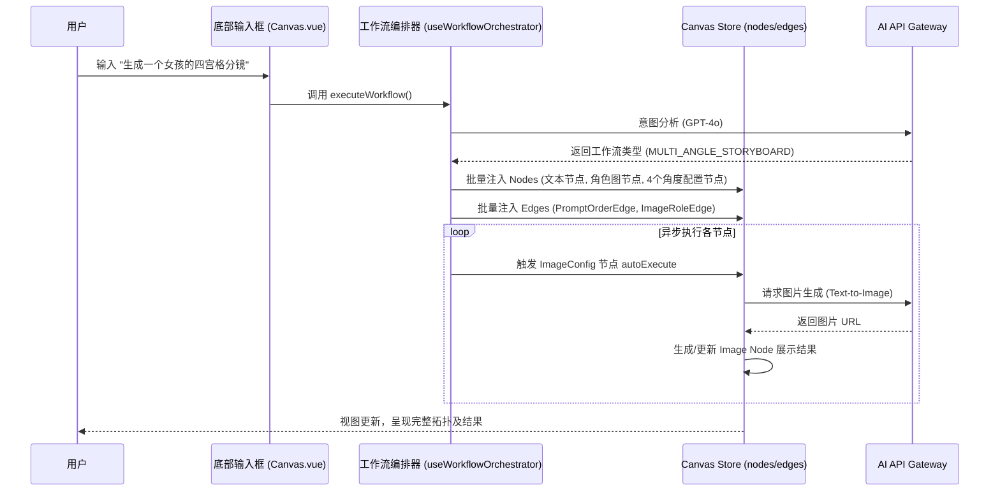
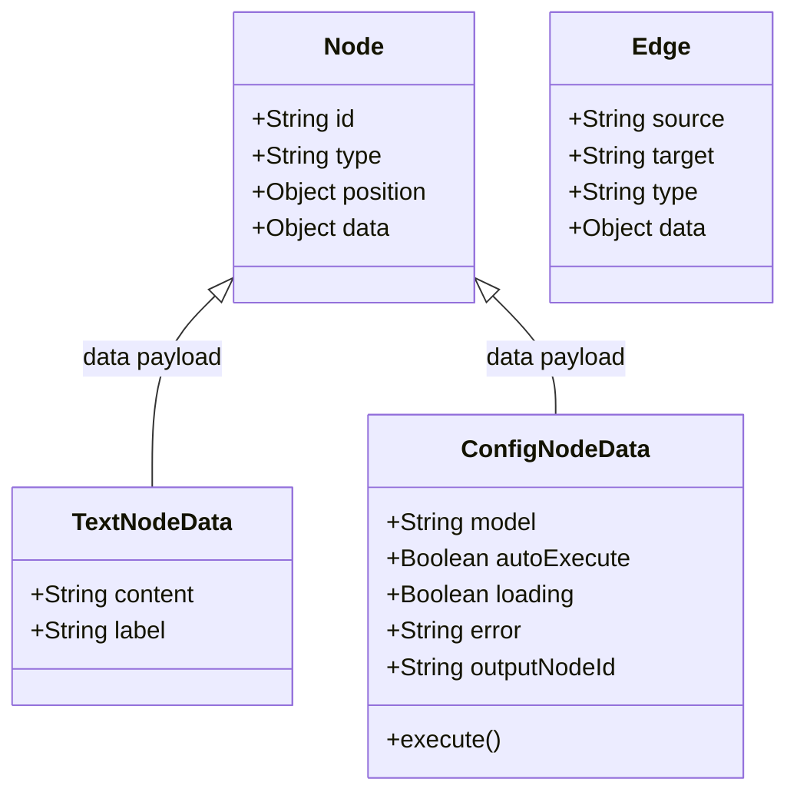
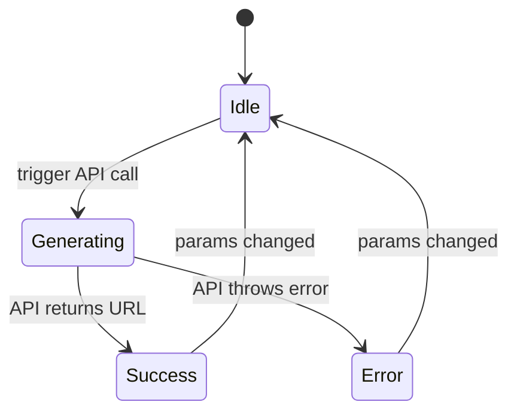

# AI Canvas - 深度技术设计文档 (TECH.md)

> 本文档旨在对 `huobao-canvas` 进行极其详尽的系统解剖，指导核心开发者进行架构理解、功能扩展及重构。

---

## 目录
- [卷一：深度项目概览](#卷一深度项目概览)
- [卷二：系统架构解剖](#卷二系统架构解剖)
- [卷三：核心子系统详解 - 画布与节点引擎](#卷三核心子系统详解---画布与节点引擎)
- [卷四：核心子系统详解 - 智能工作流编排](#卷四核心子系统详解---智能工作流编排)
- [卷五：数据与存储架构](#卷五数据与存储架构)
- [卷六：网络通信与API集成](#卷六网络通信与api集成)

---

## 卷一：深度项目概览

### 1.1 核心定位与哲学
`huobao-canvas`（AI Canvas）是一个基于节点的、可视化的 AI 创作工作流引擎。其核心哲学是 **“将 AI 能力具象化为可编排的节点”**。通过将大语言模型（LLM）、文生图（Text-to-Image）、图生视频（Image-to-Video）等离散的 AI 能力封装为原子化节点，用户可以通过拖拽和连线的方式，自由组合出复杂的创作工作流（如多角度分镜生成、儿童绘本生成等）。

**设计价值观：**
- **可视化优先**：所有数据流向（如 Prompt 到模型，图片到视频首帧）必须在画布上以有向边（Edge）的形式显式表达。
- **状态自治**：每个节点拥有独立的生命周期和状态机（Idle, Loading, Success, Error），节点间的状态传递通过响应式状态管理完成。
- **AI 驱动编排**：除了手动连线，系统内置了强大的 `useWorkflowOrchestrator`（智能工作流编排器），通过分析用户的自然语言意图，自动在画布上生成并执行对应的拓扑结构。

### 1.2 技术栈全景解析
项目基于现代前端工程化标准构建，核心技术选型如下：

1. **核心框架：Vue 3.5.24 + Composition API**
   - **为何选择**：利用 Vue 3 的 Proxy 响应式系统，完美契合画布中节点坐标、状态、连线等高频更新的数据模型，实现细粒度的视图重绘。
2. **画布引擎：Vue Flow (`@vue-flow/core` 1.48.1)**
   - **为何选择**：Vue 生态中最强大的节点连线引擎，原生支持 Vue 的响应式，提供了开箱即用的拖拽、缩放、框选、连线吸附等能力。通过自定义 Node 和 Edge，可以轻易扩展出具有复杂业务逻辑的组件。
3. **状态管理：Pinia 3.0.4**
   - **为何选择**：作为画布全局状态（`nodes`, `edges`, `viewport`）、项目管理（`projects`）、模型配置（`models`）的中央存储。其扁平化的 Store 设计非常适合管理复杂的图数据结构。
4. **构建与样式：Vite 5.2.0 + Tailwind CSS 3.4.0 + Naive UI**
   - **为何选择**：Vite 提供极速的冷启动和 HMR；Tailwind 提供原子化 CSS，加速节点卡片和面板的 UI 开发；Naive UI 提供高质量的基础表单组件。

---

## 卷二：系统架构解剖

### 2.1 宏观架构图 (Architecture)

系统整体采用典型的“分层+总线”架构，从下至上分为存储层、引擎层、业务层和视图层。


### 2.2 核心模块交互拓扑

系统中最核心的交互链路是“用户输入 -> AI 分析 -> 画布拓扑生成 -> API 异步调用 -> 结果回填”。



---

## 卷三：核心子系统详解 - 画布与节点引擎

### 3.1 职责定义
画布系统是整个应用的基石，负责渲染所有的节点（Nodes）和连线（Edges），并处理用户交互（拖拽、连线、缩放）。所有的业务数据（如提示词、图片 URL、API 配置）均作为 `node.data` 挂载在 Vue Flow 的节点对象上。

### 3.2 节点类型体系设计
项目中自定义了多种特定业务语义的节点，均注册在 `src/views/Canvas.vue` 中的 `nodeTypes`：

1. **`TextNode` (文本节点)**：作为输入源，提供提示词（Prompt）或者剧本。
2. **`ImageConfigNode` / `VideoConfigNode` (配置节点)**：**核心计算节点**。它们是工作流的“引擎”。包含模型选择、尺寸设置等。它们会监听前置节点的数据变化，组装参数并调用 API。
3. **`LLMConfigNode` (LLM 文本生成节点)**：通过大语言模型扩写或生成结构化提示词。
4. **`ImageNode` / `VideoNode` (媒体展示节点)**：纯展示节点，负责渲染生成后的图片或视频结果，也支持用户手动上传图片作为参考源（Image2Video 的首帧）。

### 3.3 连线系统设计 (Edge Types)
普通连线只能表达拓扑关系，本项目中通过自定义 Edge 赋予了连线特定的业务语义：

- **`PromptOrderEdge`**: 表达提示词的组合顺序。当多个 `TextNode` 连接到同一个 `ImageConfigNode` 时，连线上会显示序号（1, 2, 3），引擎会根据这个序号拼接最终的 Prompt。
- **`ImageRoleEdge`**: 图片角色边。当 `ImageNode` 连接到 `VideoConfigNode` 时，连线属性定义了这张图片是作为“首帧 (first_frame_image)”还是“尾帧 (last_frame_image)”。



---

## 卷四：核心子系统详解 - 智能工作流编排

### 4.1 职责定义
`useWorkflowOrchestrator.js` 是本项目的**最强大脑**。它解决的核心问题是：用户只需输入一句话，系统如何自动在画布上创建正确的节点拓扑，并协调它们按正确的顺序异步执行。

### 4.2 意图分析与路由 (Intent Analysis)
系统首先使用 GPT-4o 进行意图分析。
- 输入: `"生成一个穿红裙子的女孩的多角度分镜"`
- 输出: JSON 格式，识别出 `workflow_type: "multi_angle_storyboard"` 以及相关的角色描述。目前支持五种工作流类型：`text_to_image`, `text_to_image_to_video`, `storyboard`, `multi_angle_storyboard`, `picture_book`。

### 4.3 编排执行引擎 (Orchestration Engine)
编排器通过 `Promise` 和 Vue 的 `watch` 机制实现了一个**异步节点状态机**。
核心函数：`waitForConfigComplete` 和 `waitForOutputReady`。

**执行流程伪代码解析:**
```javascript
// 以 executeStoryboard (分镜工作流) 为例
async function executeStoryboard(character, shots, position) {
  // 1. 在画布上创建“角色描述文本节点”和“角色参考图配置节点”并连线
  const charText = addNode('text', position, { content: character.desc });
  const charConfig = addNode('imageConfig', position, { autoExecute: true });
  addEdge(charText, charConfig);

  // 2. 阻塞等待：监听画布上 charConfig 节点的状态
  // 编排器通过 watch 监听 node.data.outputNodeId 是否生成
  const charImageId = await waitForConfigComplete(charConfig.id);
  
  // 3. 阻塞等待：等待输出节点(图片节点)加载完成
  await waitForOutputReady(charImageId);

  // 4. 循环生成各个分镜
  for(const shot of shots) {
     const shotText = addNode('text', position, { content: shot.prompt });
     const shotConfig = addNode('imageConfig', position, { autoExecute: true });
     
     // 将文本节点和刚才生成的角色参考图节点一起连入分镜配置节点
     addEdge(shotText, shotConfig);
     addEdge(charImageId, shotConfig); // 保持角色一致性
     
     // 再次阻塞等待当前分镜生成完毕...
     await waitForConfigComplete(shotConfig.id);
  }
}
```

**设计精妙之处：**
- **状态驱动，非命令式**：编排器不直接调用 API，而是通过修改 Store 在画布上“画”出配置节点，并将节点设为 `autoExecute: true`。节点自身内部的逻辑会检测到连线和状态变化，从而触发 API 请求。编排器仅仅是作为一个高层“观察者”，通过 `watch` 监听节点内部数据的变化来决定是否进入下一步。这种解耦保证了画布引擎和编排引擎的完全独立。

---

## 卷五：数据与存储架构

### 5.1 本地优先存储 (Local-First Storage)
项目的所有状态数据（画布、项目列表、API配置）目前均采用 `localStorage` 进行持久化，无需后端数据库即可运行。

1. **`canvas.js` (Canvas Store)**: 
   - 存储 `nodes` (节点数组), `edges` (连线数组), `viewport` (画布缩放和偏移)。
   - 提供撤销/重做（Undo/Redo）功能：通过深拷贝保存画布状态快照到 `history` 数组。
2. **`projects.js` (Projects Store)**:
   - 存储所有的历史项目元数据（ID, 名称, 最后修改时间, 预览图等）。
3. **`models.js` / `api.js`**:
   - 存储用户的 API Key, Base URL 以及各个大模型厂商（OpenAI, Zhipu, Minimax 等）的可用模型列表。

### 5.2 画布数据流向 (Data Flow)
节点的数据计算流程是单向的（从左至右）：
`TextNode (数据源)` -> `Edge (传递)` -> `ConfigNode (处理)` -> `API` -> `ConfigNode (接收)` -> `Image/Video Node (消费)`。



---

## 卷六：网络通信与 API 集成

### 6.1 OpenAI 兼容架构
系统底层的网络请求封装在 `src/api/` 目录下。为了最大化兼容性，系统强制要求所有模型服务商必须提供 **OpenAI 格式** 的 API 接口。

- **`chat.js`**: 负责处理大语言模型的流式对话（Streaming Chat Completions），用于提示词润色和意图分析。使用原生的 `fetch` 配合 `ReadableStream` 实现打字机效果。
- **`image.js`**: 负责调用 `v1/images/generations` 接口生成图片。
- **`video.js`**: 负责视频生成（如智谱的 CogVideoX 或 Minimax 的视频模型）。

### 6.2 错误处理与重试
所有 API 请求均被封装在带有异常捕获的钩子中。如果生成失败，错误信息会直接挂载到 `node.data.error` 上，Vue 视图会响应式地将该节点边框变为红色，并在节点内部展示错误堆栈，同时中断 `useWorkflowOrchestrator` 的后续等待链，保证了异常的可观测性。
