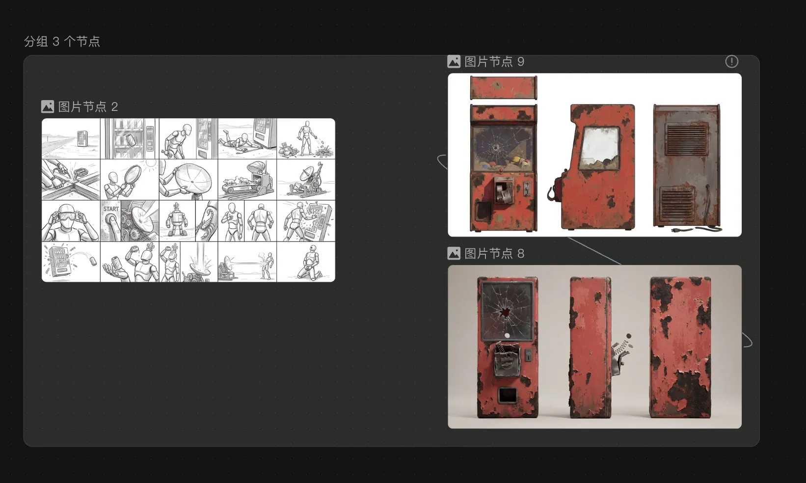
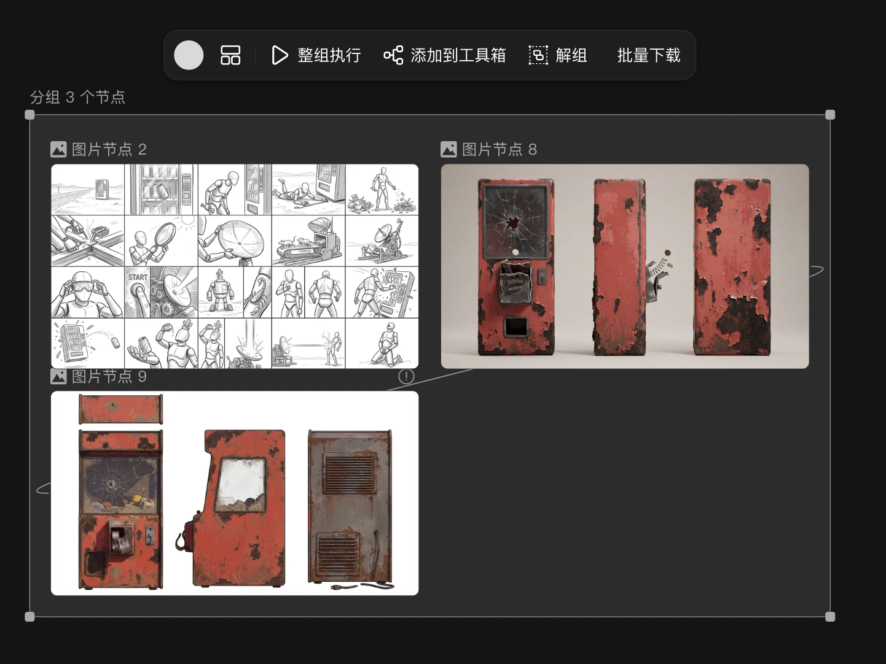
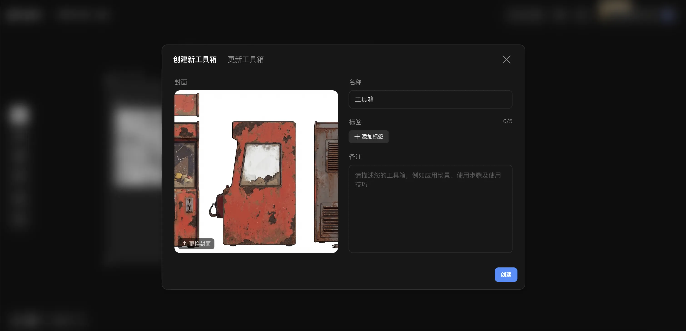

## 修改1

1. 不要「空格 + 拖拽」平移，改为**鼠标悬停移动**即可平移画布。
2. 打组后**不新增节点**，用半透明浅色矩形框住选中区域；默认样式见 。
3. 点击打组区域出现工具栏：
   - **底色**：6 种预设 +「不使用」
   - **排列**：宫格 / 水平（示意 ）
   - **整组执行**：可选提示词，按节点连线依赖顺序依次执行可生成内容的节点
   - **添加到工具箱**：弹框命名，参考 
   - **解组**：只去掉框与成组关系，不删节点
   - **批量下载**：组内可下载资源

## 修改2

1. 框出的区域跟之前选中的区域有些差别
2. 工具栏出现在打组框里面，导致点击不了，需要放在打组框上方，并检查各按钮功能实现正常。
3. 悬停鼠标不用点空格就能平移
4. 打组框内的节点是可以拖动的，节点应该在画布上层。
5. 将悬停平移改为右键拖拽平移，正在查看 Canvas.vue 中 Vue Flow 的配置与相关处理。
6. 将右键改为上下文菜单，并在 Mac 触控板上启用双指滑动平移。正在查看 Vue Flow 中 pan-on-scroll 与 zoom-on-scroll 的交互。
7. 打组区域需要固定不变，不随节点移动而变换区域，节点区域可以移除打组框范围，打组区域非节点可移动整个打组框
8. 将打组改为固定矩形（不随节点重算），并支持拖动整个打组框。正在查看 canvas.js 与 Canvas.vue 中的分组实现。实现固定 frame 矩形（创建时写入、不随节点重算）、在 loadProject 中迁移旧数据，并通过顶栏拖拽移动整个打组框。
9. 拖框时同时平移组内节点
10. 打组框选中不只是顶部，而是整个框内非节点区域都可以选中打组框

## 修改点3

1. 打组框内节点要支持可以托拽出打组框，如果全部托拽出去则不参与打组框整体的平移，如果托拽出一半则还是要参与打组框的平移
2. 整组执行弹出让用户确认是否执行，点击确认后节点从头到尾执行一遍
3. 底色选择不用中文，而现实颜色图标

## 修改点4
1. 新增脚本节点，可通过左侧+号按钮添加。
  - 脚本节点有一个正方形占位框+下方一个文本输入框组成，参考【图 5-脚本生成器.png】
  - 正方形占位框展示：剧本生成分镜脚本，点击之后再左侧连接一个文本节点，文本节点默认填充内容：“《我在盛唐写天下》
**类型**：古风 / 穿越 / 爽文漫剧
**时长建议**：60–90秒
**基调**：热血 × 盛唐史诗感 × 爽点节奏
【序幕】
【现代 · 深夜办公室】
键盘声急促。电脑屏幕蓝光刺眼。 沈昭昭（女，28岁），面色苍白，伏案加班。 手机提示音不断。 她抬头，视线模糊—— 黑屏。
【第一幕】
【盛唐 · 金銮殿 · 日】
鼓声震天。 沈昭昭猛然睁眼，已跪在大殿中央，身着男装官服，双手被押。 百官列立，殿宇巍峨。 大臣厉声： “大逆不道！假称诗才惊世，欺君罔上，当斩！” 沈昭昭震惊低语： “这是……唐朝？” 龙椅之上，皇帝目光沉沉。 皇帝： “既言才华盖世，当殿作诗。若不能——斩。” 刀光映入她瞳孔。 大殿死寂。 【第二幕】 沈昭昭缓缓起身。 呼吸渐稳。 她望向殿外—— 长安城阳光万里。 她低声： “既来盛唐……便与盛唐争一争。” 抬头，高声吟诵： “君不见黄河之水天上来——” 声音回荡大殿。 群臣震动。 皇帝缓缓站起。 诗声激昂，如惊雷落殿。 【第三幕】 殿外风起。 长安街市灯火连绵。 皇帝低声： “此诗，当传万世。” 沈昭昭目光坚定。 她轻声自语： “既然来了……那便写尽三万里长安。” 镜头推远。 盛唐山河展开。”，支持修改以及自己上传剧本。
  - 文本输入框左下方可以设置模型，右下角可以执行按钮，如果有没有输入提示词则不能点击，输入可执行。placeholder展示文案: “描述剧情或添加角色参考、视频参考等，为你生成分镜脚本”。
2. 执行按钮点击之后，请求接口通过提示词生成分镜脚本，接口就就该任务放入对应的执行任务队列后返回任务ID，正方形占位框开始进入加载进度条状态，间隔时间查询任务执行进度，等待执行完成后变换成表格形式，参考图【】，表格列名包括（镜号/画面描述/角色1/角色描述1/角色图1/角色动作/场景标签/光影氛围/对白/分镜提示词/视频运动提示词）。
3. 脚本表格可展开全屏也可以恢复原来。景号可托拽改变场景顺序。默认展示脚本视频，切换创意视图后按照卡片基本信息展示。
4. 脚本表格上面展示工具栏（重新生成、生成分镜）。重新生成则再把该节点执行一次；生成分镜：则是根据表格中每个分镜号中的提示词生成一组图片，也就是右侧连接新的一个打组框区域（命名：分镜图 脚本生成器。可点击改名）把待生成的图片节点都框起来，同时依次命名分镜#1、分镜#2 ...，打组框内的图片节点支持单独重新生成，参考图【6-分镜脚本UI.png】。

## 修改点5
1. 脚本生成器点击生成分镜时，需要右边连接这个打组框区域
2. 这个打组框区域排列上下左右太大，需要紧凑一点
3. 打组框区域非节点的地方都可以支持托拽，并选中支持delete删除整块区域所有内容
4. 点击打组框工具栏整组执行，需要并行执行节点中的生图或者生视频，并能够显示执行进度条。
5. 图片节点默认选中seedream，视频节点默认选中seedance1.5pro
6. 不是连线到每个 imageConfig 节点，但是需要把打组框作为一个新的虚拟节点
7. 打组框内图片节点上下间距太大了
8. 分镜图脚本生成器点击整组执行时弹框执行时没有反应，脚本生成器中图片节点应该有显示提示词的地方并且自动填充分镜脚本生成器之前生成好的每个表格中对应的图片生成图片词。
9. 脚本生成器出现BUG，生成完成后提示生成请重试，但是deepseek已经流式输出完了
10. 图片节点需要改造，参考【8-图片节点UI.png】，图片节点下边框增加类似文本输入框的控制，点击图片节点展示，点击其他位置后隐藏。输入框上方支持选择风格，可以选择风格，点击风格后弹框显示风格广场（我的收藏/最近使用），展示分类：推荐/摄影写真/电商营销/动漫游戏/风格插画/平面设计/建筑及室内设计/创意玩法/文创周边/小说推文，当前模型（Seedream 4.5），最多使用（可切换排序，最新时间）。风格展示一张主图和使用数，可以收藏，点击后作为使用。最下面支持选择模型、分辨率/比例、张数（1/2/4张）、执行按钮。
11. 文生图节点点击执行时不需要新增图片节点，而是更新当前接口的图片。明白了，执行时不要另开图片节点，直接把生成结果更新到当前节点的预览区内。需要修改 handleGenerate 逻辑和 previewImageUrl 计算属性：
12. 设置分辨率和尺寸生图的时候没生效。
13. 选择多张图时，生成多张图排列在一起，参考图【9-多张图UI.png】，有多层折叠在一起效果，支持展开其他图片，参考图【10-多张图展开UI.png】 ，展开后支持切换主题，将整个多张图作为一个节点，切换主题后则可作为下个节点输入。

## 修改点6
1. 分镜脚本生成器上分新增批量视频生成按钮，点击后画布聚焦自动聚焦在该脚本打组框，显示模型，可以选择多个视频生成模型（seedance 1.5 pro、可灵、万相等），还可以选择视频比例：清晰度（480P\720P\1080P）、视频时长（5s/10s）、生成音频（开启/关闭），不同组合右边【生成视频】按钮的积分会有变化。参考图【@docs/images/11-批量生成视频UI.png】
2. 点击生成视频后右侧连接一个新的打组框（命名视频组-分镜图-脚本生成器），将分镜脚本图用于首尾帧参考视频生成（例如：首帧#1尾帧#2，最后一张可首帧），视频生成提示词则通过之前的剧本脚本生成器获取然后填充提示词。所有视频都是并行调用执行生成，生成过程中显示执行进行，参考图【 12-视频生成中UI.png 】，单个生成视频不影响其他。视频生成完成后展示效果参考图【 13-生成视频结果UI.png 】
3. 批量生成视频的弹框不是在整个页面，而是在分镜打组框的下方（已实现：`Canvas.vue` 内 `#zoom-pane` 锚定面板）

## 修改点7

1. 批量生成视频的弹框不是在整个页面，而是在分镜打组框的下方（同上）
2. 等待所有视频生成完成后除了支持批量下载，也需要支持自动剪辑，自动剪辑则是把所有视频按顺序拼接成一个视频下载（已实现：组工具栏「自动剪辑」+ `src/utils/videoConcat.js` FFmpeg.wasm）
3. 批量下载只下载了一个，应该打包在一个文件中下载打组内所有的视频（已实现：组内 2 个及以上 `image`/`video` 链接触发 zip 打包下载，`src/utils/groupZipDownload.js`）

## 修改点8
1. ~~脚本生成器生成剧本时，时长是5～10秒，需要根据提示词时长最分镜，例如要求30秒分镜，那么场景生成就是6个场景~~（已实现：`src/utils/scriptStoryboard.js` 推断总秒数，按每镜约 5 秒算镜数并写入系统提示；`ScriptNode.vue` 动态 `buildStoryboardSystemPrompt`）
2. ~~接口生成剧本失败时解析分镜 JSON 失败~~（已实现：增强 `parseScriptJSON`；失败时同模型非流式 `repairStoryboardJsonViaLlm` 修复后再解析）

## 修改点9
1. 从分镜图生成分镜视频时，有剧本脚本器连接的节点需要把脚本生成器的视频运动提示词传递过去作为图生视频的提示词
2. 需要对视频生成完成的节点就行编辑，参考图【/opt/www/github/huobao-canvas/docs/images/14-分镜视频节点.png】
3. 点击视频节点需要像图片节点逻辑一样可以弹出编辑
4. 点击文生视频后，切换不回来图生视频
5. 视频组的图生视频的首帧应该从前一个分镜组节点获取到自动填充的，并且支持替换上传；复制当前提示词应该改成中/英切换